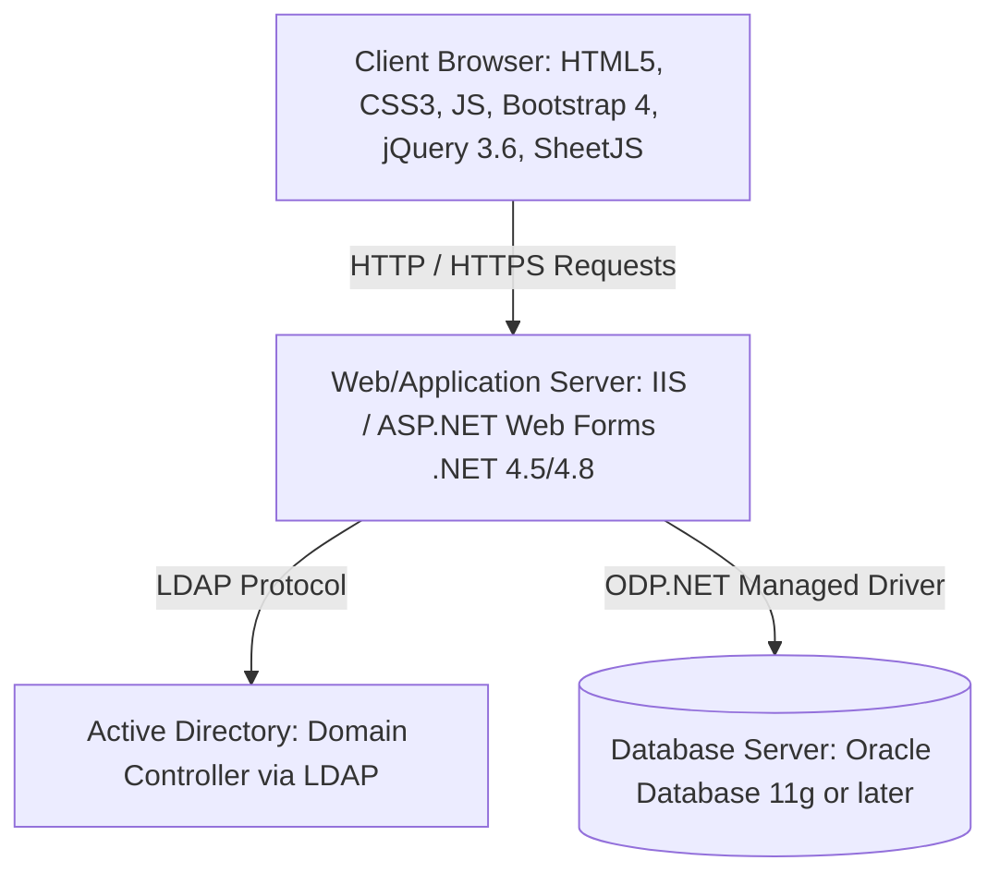
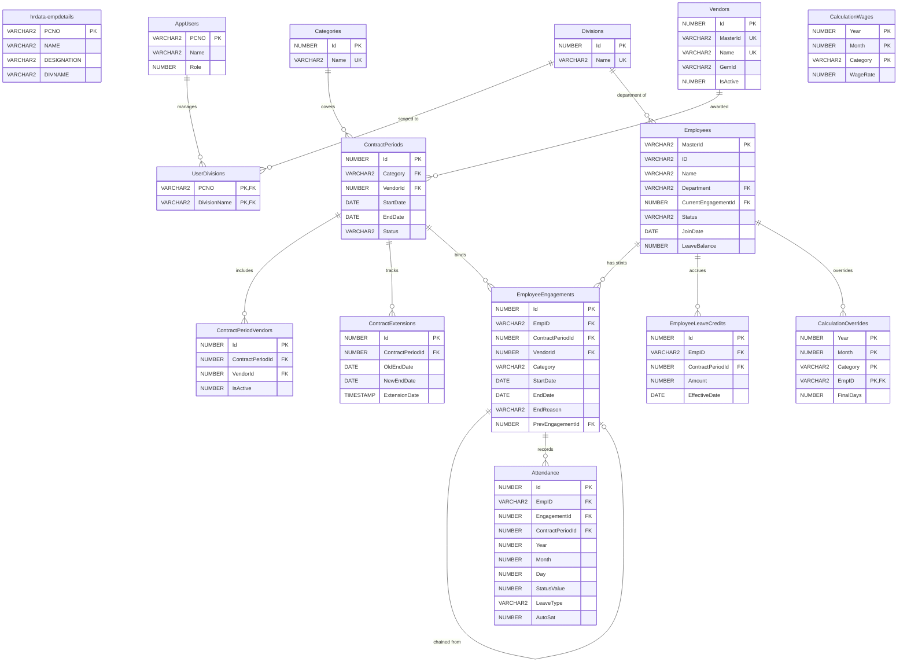
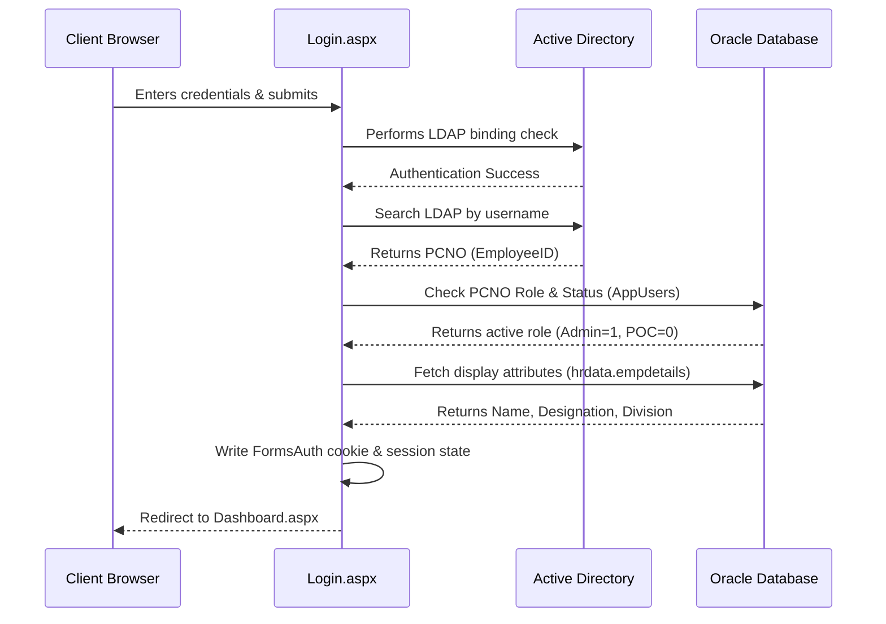
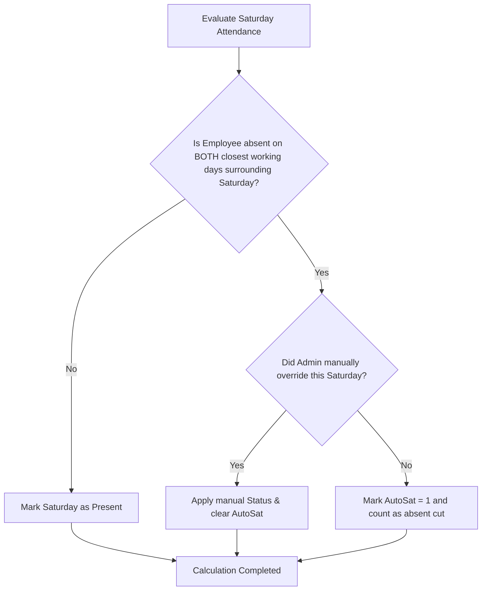
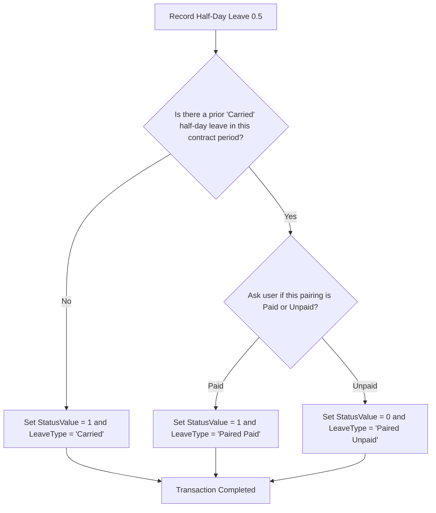
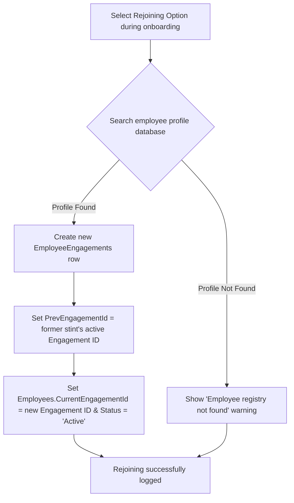
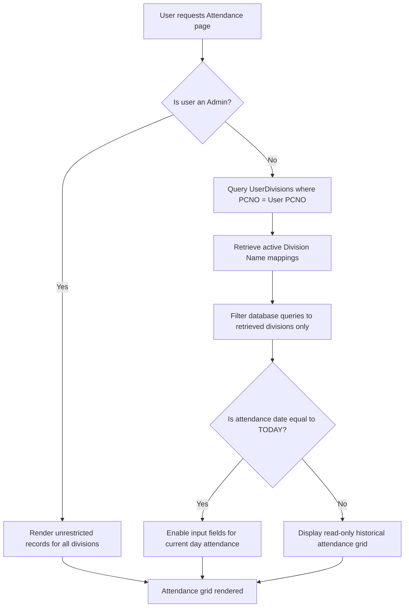

# Software Requirements Specification
## for
## Attendance & Contract Workforce Management System (AMS)

**Version:** 1.0 (Approved)  
**Date:** July 7, 2026  
**Prepared by:** Yajnesh  

---

## Revision History

| Name | Date | Reason for Changes | Version |
| :--- | :--- | :--- | :--- |
| Yajnesh | 07-Jul-2026 | Initial version incorporating database schema, business rules, and system capabilities. | 1.0 |

---

## Table of Contents
1. [Introduction](#1-introduction)
   - 1.1 Purpose
   - 1.2 Document Conventions
   - 1.3 Intended Audience and Reading Suggestions
   - 1.4 Product Scope
   - 1.5 References
2. [Overall Description](#2-overall-description)
   - 2.1 Product Perspective
   - 2.2 Product Functions
   - 2.3 User Classes and Characteristics
   - 2.4 Operating Environment
   - 2.5 Design and Implementation Constraints
   - 2.6 User Documentation
   - 2.7 Assumptions and Dependencies
3. [External Interface Requirements](#3-external-interface-requirements)
   - 3.1 User Interfaces
   - 3.2 Hardware Interfaces
   - 3.3 Software Interfaces
   - 3.4 Communications Interfaces
4. [System Features](#4-system-features)
   - 4.1 Authentication & Domain Authorization (`Login.aspx`)
   - 4.2 Role-Based Navigation & Division Scoping (`Dashboard.aspx`)
   - 4.3 Vendor Registry & History Management (`Vendors.aspx`)
   - 4.4 Contract Period Lifecycle Management (`Contracts.aspx`)
   - 4.5 Employee Master & Career Chaining (`Employee.aspx`)
   - 4.6 Daily Attendance Grid & Override Actions (`Attendance.aspx`)
   - 4.7 Month-End Wages Adjustments & Calculations (`Calculation.aspx`)
   - 4.8 Ledger Reports & Leaves Auditing (`Ledger.aspx`)
   - 4.9 Correction Requests Workflow (`UserRemarks.aspx` & `Remarks.aspx`)
   - 4.10 Notices & Information Board (`Notices.aspx`)
   - 4.11 Document Settings & Certificate Generation (`Documents.aspx`)
   - 4.12 System Settings & Transaction Control (`Settings.aspx`)
5. [Other Nonfunctional Requirements](#5-other-nonfunctional-requirements)
   - 5.1 Performance Requirements
   - 5.2 Safety Requirements
   - 5.3 Security Requirements
   - 5.4 Software Quality Attributes
   - 5.5 Business Rules Summary
6. [Other Requirements & Database Schema](#6-other-requirements--database-schema)
   - 6.1 Database Schema Design
   - 6.2 Table Descriptions and Columns
   - 6.3 Database Linking & Primary/Foreign Key Relationships
7. [Appendices](#7-appendices)
   - Appendix A: Glossary
   - Appendix B: Analysis Models (System Flowcharts & Diagrams)

---

## 1. Introduction

### 1.1 Purpose
This Software Requirements Specification (SRS) describes the complete functional and non-functional requirements for the Attendance & Contract Workforce Management System (AMS), Version 1.0. This document outlines the system architecture, database structure, business rules, and user interfaces designed to manage contract employees across their engagement periods. 

### 1.2 Document Conventions
- **Database Objects**: Table and column names are capitalized according to the Oracle database schema (e.g., `Employees`, `StatusValue`).
- **Functional Requirements**: Uniquely tagged using the prefix `REQ-<MODULE>-<NUMBER>` (e.g., `REQ-ATT-01`).
- **Priorities**: Individual functional requirements are classified as High, Medium, or Low.

### 1.3 Intended Audience and Reading Suggestions
This document is prepared for:
1. **System Owners & Administrators**: To verify that all business workflows and security restrictions are correctly specified.
2. **Developers & Maintainers**: To serve as a reference for building, refactoring, and maintaining the codebase.
3. **Deployment Engineers**: To understand the operating environment, dependencies, and configuration parameters.

### 1.4 Product Scope
AMS is a secure, intranet-hosted web application developed to replace paper-based attendance logs and manual spreadsheets. It manages the complete lifecycle of contract manpower supplied by external vendors, tracks employee career histories across contract terms, automates daily attendance calculations (including complex Saturday cuts and half-day leaves), processes payable cycles, and exports certified legal documents (such as Satisfactory Certificates and Covering Letters) as formatted Word and Excel files. 

*Out of Scope*: Direct financial payment disbursal or integration with public external web networks.

### 1.5 References
- IEEE Std 830-1998: Recommended Practice for Software Requirements Specifications.
- Project Oracle Schema definition file (`oracle_setup.sql`).

---

## 2. Overall Description

### 2.1 Product Perspective
AMS is a self-contained, three-tier intranet web application designed to operate in an air-gapped corporate environment. It relies on a local corporate Active Directory for user authentication and integrates with a read-only corporate HR repository schema for personnel profile resolution. 

### 2.2 Product Functions
At a high level, the system provides the following functions:
- **Domain Authentication**: Authenticates users via corporate credentials.
- **Division-Scoped Access Control**: Restricts data access for regular users to their assigned divisions.
- **Vendor & Contract Lifecycles**: Tracks vendor histories and manages contract periods.
- **Employee Master Profile**: Manages profiles, qualifications, experience, and complete engagement history.
- **Daily Attendance Marking**: Provides a calendar interface for marking attendance, applying Saturday-cut and half-day pairing logic.
- **Payroll Wage Processing**: Computes monthly payable days with manual adjustments (additions/deductions) and generates wages.
- **Leave Ledger Audits**: Computes running balances, paid/unpaid leaves, and carries forward balances.
- **Document Template Hub**: Generates dynamic Covering Letters, Invoices, and certificates with placeholders and dynamic signatory lookups.

### 2.3 User Classes and Characteristics
The application supports two active user classes:

1. **System / HR Administrator**:
   - **Department**: Human Resources (HR).
   - **Access Level**: Full administrative access.
   - **Capabilities**: Manages vendors, contract periods, employee master records, leave audits, wage calculation, global parameters, template settings, and can change attendance data for any day or month.
   
2. **Regular Division User (Point of Contact - POC)**:
   - **Department**: Assigned organizational divisions.
   - **Access Level**: Scoped access restricted to employees in assigned divisions.
   - **Capabilities**: Access to the Attendance page (edit/mark today's attendance only), Ledger, Notices, and submission of correction remarks to the admin. POCs cannot edit past attendance, override Saturday cuts, or access Settings/Admin Management.

### 2.4 Operating Environment
- **Web Host**: Microsoft Internet Information Services (IIS).
- **Framework**: ASP.NET Web Forms (.NET Framework 4.5/4.8).
- **Database**: Oracle Database 11g or later.
- **Authentication**: Active Directory Domain Controller reachable over LDAP (Port 389/636).
- **Client Requirements**: Modern web browsers (Chrome, Edge, Firefox) configured for standard corporate desktop displays.
- **Development Tooling**: Visual Studio 2015.

### 2.5 Design and Implementation Constraints
- **Air-Gapped Operation**: No external internet connectivity is available. All CSS, JavaScript, and asset libraries must be hosted locally on the intranet server.
- **Oracle 11g Compatibility**: The database schema must not use features from Oracle 12c or higher (such as native `IDENTITY` columns). Auto-incrementing primary keys are implemented using `SEQUENCE` objects combined with `BEFORE INSERT` triggers.
- **Client-Side Document Export**: Word and Excel document generation must be performed client-side to prevent installing server-side dependencies like MS Office Interop or OpenXML SDK.

### 2.6 User Documentation
The system provides:
- In-application contextual tooltips and interactive modal forms.
- A list of template placeholders for dynamic sentence customizations in `Documents.aspx`.

### 2.7 Assumptions and Dependencies
- **AD Domain Controller**: An active, reachable Active Directory domain controller is assumed.
- **HR Master Database Table**: The corporate database is assumed to provide `hrdata.empdetails` to resolve personnel details (PCNO, Name, Designation, Division) at login.

---

## 3. External Interface Requirements

### 3.1 User Interfaces
- **Layout & Structure**: A unified, responsive master layout (`Site.Master`) with a side or top navigation bar.
- **Design Language**: Styled using Bootstrap 4, Vanilla CSS, and SweetAlert2 for popups and notifications.
- **Interactive Grids**: Calendar-style grids for attendance entry and tabular lists with column-toggling options for exports.

### 3.2 Hardware Interfaces
No dedicated hardware interfaces are required. The system communicates via TCP/IP networks on standard server and client computer terminals.

### 3.3 Software Interfaces
- **Database Management System**: Oracle Database 11g or later, utilizing `Oracle.ManagedDataAccess.dll` (ODP.NET Managed Driver) for high-performance data access.
- **Directory Service**: Active Directory reachable via LDAP protocol.
- **HR Reference Database**: Accessible table `hrdata.empdetails` located on a separate corporate schema.
- **Excel Spreadsheet Compiler**: SheetJS (`xlsx.full.min.js`) library loaded client-side.

### 3.4 Communications Interfaces
- **Intranet Communication**: Client-to-server interaction over HTTP/HTTPS.
- **LDAP Binding**: LDAP (port 389) or LDAPS (port 636) for active directory lookups.

---

## 4. System Features

### 4.1 Authentication & Domain Authorization (`Login.aspx`)
#### 4.1.1 Description and Priority
Provides secure access control by validating corporate credentials against Active Directory and mapping authenticated users to their corresponding database roles and division scopes.  
**Priority**: High

#### 4.1.2 Stimulus/Response Sequences
- **User Action**: Enters corporate Username and Password and submits the login form.
- **System Action**: 
  1. Binds credentials to Active Directory via LDAP.
  2. Resolves user's `EmployeeID` (PCNO) via LDAP search.
  3. Verifies PCNO status in the `AppUsers` table. If revoked, shows an access-denied message.
  4. Fetches profile attributes (Name, Designation, Division Name) from `hrdata.empdetails`.
  5. Issues Forms Authentication cookie and redirects to `Dashboard.aspx`.

#### 4.1.3 Functional Requirements
- **REQ-AUTH-01**: The system shall validate user credentials by executing an LDAP bind against the path configured in `Web.config`.
- **REQ-AUTH-02**: The system shall resolve the corporate username to a unique PCNO from Active Directory.
- **REQ-AUTH-03**: The system shall verify the user's role in the `AppUsers` database table. Users with `Role` values of 2 (Revoked Admin) or 3 (Revoked User) shall be denied access.
- **REQ-AUTH-04**: The system shall query `hrdata.empdetails` to retrieve the user's official Name, Designation, and Division Name to establish the session identity.
- **REQ-AUTH-05**: Anonymous access shall be denied on all pages except `Login.aspx` and the static assets folder.

---

### 4.2 Role-Based Navigation & Division Scoping (`Dashboard.aspx`)
#### 4.2.1 Description and Priority
Presents the landing page of the application, rendering navigation menus and data summaries filtered by the logged-in user's role and assigned divisions.  
**Priority**: High

#### 4.2.2 Stimulus/Response Sequences
- **User Action**: Navigates to the application.
- **System Action**: Retrieves session information and displays the dashboard interface. For regular division users, filters all employee lists, ledger queries, and attendance inputs to the divisions listed in the user's profile.

#### 4.2.3 Functional Requirements
- **REQ-DASH-01**: The system shall display navigation links scoped to the user's role: administrators see all pages; regular users (POCs) see only Attendance, Ledger, Notices, and Remarks pages.
- **REQ-DASH-02**: The system shall filter all database queries on employees, attendance records, and leave transactions to match the divisions mapped to the user's PCNO in the `UserDivisions` table.
- **REQ-DASH-03**: The dashboard shall display notifications for administrators showing the number of unread correction requests (`AttendanceRemarks.IsRead = 0`).

---

### 4.3 Vendor Registry & History Management (`Vendors.aspx`)
#### 4.3.1 Description and Priority
Maintains a registry of third-party contractor agencies, contact information, and active status, alongside a historical overview of their active and completed contracts.  
**Priority**: High

#### 4.3.2 Stimulus/Response Sequences
- **Administrator Action**: Opens `Vendors.aspx` to register, edit, or deactivate a vendor.
- **User/Admin Action**: Opens a vendor profile to view the vendor's history of past contract periods and contract employee counts.

#### 4.3.3 Functional Requirements
- **REQ-VEND-01**: The system shall maintain vendor records with a unique agency `MasterId`, name, GeM ID, contact phone, contact person, and address.
- **REQ-VEND-02**: The system shall allow deactivating a vendor (setting `IsActive = 0`) instead of performing a hard delete, to maintain historical data references.
- **REQ-VEND-03**: The vendor page shall display a detailed transaction history listing all contract periods awarded to the vendor and their historical worker counts.

---

### 4.4 Contract Period Lifecycle Management (`Contracts.aspx`)
#### 4.4.1 Description and Priority
Manages formal contract periods, typically active for 2 years, with options for extensions, leave balance initiation, and employee enrollments.  
**Priority**: High

#### 4.4.2 Stimulus/Response Sequences
- **Administrator Action**: Creates a new contract period, defining category, vendor, start date, and end date. Defines the initial leave balance for employees under the new contract period.
- **Administrator Action**: Modifies a contract period's end date to record an extension.
- **System Action**: Automatically closes expired contract periods via database transaction.

#### 4.4.3 Functional Requirements
- **REQ-CONT-01**: The system shall enforce a unique constraint on the combination of `(Category, StartDate)` to prevent overlapping contracts for the same skill category.
- **REQ-CONT-02**: The default contract duration shall be 2 years. The system shall allow administrators to extend an active contract period, logging the modification history in `ContractExtensions`.
- **REQ-CONT-03**: The system shall provide an option during contract creation to initialize a fresh leave balance for enrolled employees for a single year.
- **REQ-CONT-04**: An background transaction loop running every 5 seconds on database access shall automatically query expired contract periods, update their status to `'Closed'`, set the active engagements end dates to the contract end date, and release enrolled employees by setting their `CurrentEngagementId` to `NULL` and `Status` to `'ContractEnded'`.
- **REQ-CONT-05**: Deleting a contract period shall only be permitted when explicitly confirmed and audit-logged.

---

### 4.5 Employee Master & Career Chaining (`Employee.aspx`)
#### 4.5.1 Description and Priority
Serves as the main repository for contract workers, maintaining demographic details, skill category assignments, department history, qualifications, experience, and rejoining linkages.  
**Priority**: High

#### 4.5.2 Stimulus/Response Sequences
- **Administrator Action**: Adds a new employee or edits an existing employee's profile.
- **Administrator Action**: Flags an employee as rejoining, linking their new engagement stint to their existing historical registry.
- **User Action**: Enters qualifications or years of experience in search fields to filter the workforce list.
- **Administrator Action**: Deletes an employee record.

#### 4.5.3 Functional Requirements
- **REQ-EMP-01**: The system shall assign each employee a category-neutral `MasterId` as the stable primary key. Category-prefixed display identifiers (e.g. `S-1`, `SS-5`, `US-12`) shall be derived dynamically at render-time.
- **REQ-EMP-02**: The system shall track the employee's history across three category levels: **Skilled**, **Semi-Skilled**, and **Unskilled**. Upgrades, downgrades, and department transfers shall be tracked by closing the current engagement stint and launching a new row in `EmployeeEngagements`.
- **REQ-EMP-03**: The system shall support a rejoining feature. If a resigned employee rejoins after a period, the administrator shall select the rejoining option to connect their new contract engagement to their existing career history chain.
- **REQ-EMP-04**: The system shall support advanced search filters in the employee grid, enabling queries based on Name, Department, Skill Category, Status, **Qualification**, **Experience (Years)**, and **Experience Field**.
- **REQ-EMP-05**: The system shall allow an administrator to delete an employee record.
- **REQ-EMP-06**: The Employee Master shall provide an "Add Bulk Leave" option after the first year of a contract, allowing administrators to define the date from which the new leave balance is effective and the number of leaves to add.

---

### 4.6 Daily Attendance Grid & Override Actions (`Attendance.aspx`)
#### 4.6.1 Description and Priority
Provides the workspace interface for capturing daily attendance. Implements automated rules for Saturday cuts, half-day leaves, and holidays.  
**Priority**: High

#### 4.6.2 Stimulus/Response Sequences
- **POC Action**: Selects the current date and marks attendance status for employees in their division.
- **Administrator Action**: Reviews the monthly grid, updates attendance values, overrides Saturday cuts, or marks holidays.
- **System Action**: Computes Saturday cuts and updates the leave balance and remarks columns based on half-day pairing rules.

#### 4.6.3 Functional Requirements
- **REQ-ATT-01**: Attendance values shall be stored as:
  - `1` = Present
  - `0` = Absent
  - `NULL` = Not Marked
  - Leave types shall be recorded in `LeaveType` as `Paid` or `Unpaid` when an employee is absent.
- **REQ-ATT-02**: **Half-day leave logic** shall follow these rules:
  - The first half-day leave taken in a period is stored with `StatusValue = 1` and `LeaveType = 'Carried'`.
  - The next half-day leave taken triggers a prompt asking if it is paid or unpaid.
    - If **Paid**, the status is stored with `StatusValue = 1` and `LeaveType = 'Paired Paid'`.
    - If **Unpaid**, the status is stored with `StatusValue = 0` and `LeaveType = 'Paired Unpaid'`.
- **REQ-ATT-03**: **Saturday Cut logic** shall follow these rules:
  - If an employee is absent on the closest working days immediately before and after a Saturday, the Saturday is marked as an **Auto-Saturday Cut** (`AutoSat = 1`) and treated as absent.
  - If the employee is present for the entire week (or is present on either side of the Saturday), the Saturday is marked as present.
  - If the employee takes a half-day leave during the week, the Saturday is **not** marked as absent since the employee attended work.
- **REQ-ATT-04**: The system shall allow administrators to manually override Saturday cuts.
- **REQ-ATT-05**: If an employee works on a public holiday, their attendance status shall be marked as `1` (Present) and a remark shall be recorded in the database.
- **REQ-ATT-06**: The attendance grid shall support a **Global Adjustment** option to manually adjust the employee's total payable days if they do not meet the 26-day baseline or for other administrative reasons.
- **REQ-ATT-07**: Administrators shall have unrestricted rights to edit attendance for any date. Regular POC users shall only be allowed to enter or modify attendance for the current day.
- **REQ-ATT-08**: The system shall allow administrators to define calendar dates as holidays (`IsHoliday = 1`) and add corresponding remarks (e.g., National Holiday).

---

### 4.7 Month-End Wages Adjustments & Calculations (`Calculation.aspx`)
#### 4.7.1 Description and Priority
Calculates monthly wages based on attendance data and active wage rates, with support for manual adjustments (additions or deductions).  
**Priority**: High

#### 4.7.2 Stimulus/Response Sequences
- **Administrator Action**: Selects Year, Month, and Category.
- **Administrator Action**: Enters day adjustments (+ or - days) for employees who require manual overrides.
- **System Action**: Computes the final payable wages.

#### 4.7.3 Functional Requirements
- **REQ-CALC-01**: The system shall store category-specific monthly wage rates in the `CalculationWages` table.
- **REQ-CALC-02**: The system shall allow administrators to modify the final payable days for an employee by entering additions (+ days) or deductions (- days) to resolve previous calculation errors.
- **REQ-CALC-03**: Monthly wages shall be calculated by multiplying the adjusted final days from the Calculation page by the category's daily wage rate:
  $$\text{Total Monthly Wage} = \text{Adjusted Final Days} \times \text{Daily Wage Rate}$$

---

### 4.8 Ledger Reports & Leaves Auditing (`Ledger.aspx`)
#### 4.8.1 Description and Priority
Provides a comprehensive overview of leave balances, attendance totals, and administrative adjustments.  
**Priority**: Medium

#### 4.8.2 Stimulus/Response Sequences
- **User Action**: Selects a month range and generates the ledger view.
- **System Action**: Summarizes leave allocations, deductions, present days, and remarks.

#### 4.8.3 Functional Requirements
- **REQ-LEDG-01**: The Ledger shall show the following columns:
  - Selected Months
  - Total leaves taken (Paid, Unpaid, Half-days)
  - Remaining leaves at the end of the month
  - Total days present in the month
  - Remarks recorded in the Attendance page
- **REQ-LEDG-02**: The Ledger shall carry forward unused leave balances into the subsequent month as the new opening balance.

---

### 4.9 Correction Requests Workflow (`UserRemarks.aspx` & `Remarks.aspx`)
#### 4.9.1 Description and Priority
Provides an communication channel for POC users to submit attendance corrections to HR Administrators.  
**Priority**: Medium

#### 4.9.2 Stimulus/Response Sequences
- **POC Action**: Submits a correction request detailing the employee, date, and discrepancy.
- **Administrator Action**: Views the request, applies the correction in the attendance grid, and marks the request as resolved.

#### 4.9.3 Functional Requirements
- **REQ-REM-01**: Regular users shall submit correction remarks via `UserRemarks.aspx`, specifying the Employee `MasterId`, target date, and a description.
- **REQ-REM-02**: The administrator inbox (`Remarks.aspx`) shall display correction requests sorted by recency and highlight unread entries (`IsRead = 0`).

---

### 4.10 Notices & Information Board (`Notices.aspx`)
#### 4.10.1 Description and Priority
Enables administrators to post notices, official orders, or documents for all users.  
**Priority**: Low

#### 4.10.2 Stimulus/Response Sequences
- **Administrator Action**: Uploads a notice file and adds a title.
- **User Action**: Accesses the notice board to view or download active notices.

#### 4.10.3 Functional Requirements
- **REQ-NOT-01**: Administrators shall be allowed to upload documents (PDF, Word) and set titles.
- **REQ-NOT-02**: Administrators shall be allowed to toggle notice visibility (`IsHidden = 1`) to hide notices from regular users.

---

### 4.11 Document Settings & Certificate Generation (`Documents.aspx`)
#### 4.11.1 Description and Priority
Generates monthly contract documents, certificates, and invoices using templates with dynamic placeholders.  
**Priority**: High

#### 4.11.2 Stimulus/Response Sequences
- **Administrator Action**: Modifies paragraph templates in the settings panel.
- **Administrator Action**: Selects Category, Year, and Month to preview and export documents.

#### 4.11.3 Functional Requirements
- **REQ-DOC-01**: The system shall generate three document types under `Documents.aspx`:
  1. **Attendance Certificate**: Tabulates monthly attendance metrics.
  2. **Satisfactory Certificate**: Certifies satisfactory vendor performance.
  3. **Covering Letter**: Transmittal document for finance and purchase.
- **REQ-DOC-02**: The system shall support invoice generation directly on `Documents.aspx`. The separate page `invoice.aspx` is deprecated.
- **REQ-DOC-03**: Certificate templates shall support the following placeholders:
  - `{VendorName}`
  - `{VendorAddress}`
  - `{Category}`
  - `{ContractNo}`
  - `{ContractDate}`
  - `{StartDate}`
  - `{EndDate}`
  - `{EmpCount}`
  - `{DatedOn}`
- **REQ-DOC-04**: The system shall retrieve the signatory authority's name dynamically using their `PCNO` from the HR database table.
- **REQ-DOC-05**: Word documents (`.doc`) and Excel sheets (`.xlsx`) shall be generated client-side using SheetJS and HTML blob methods.

---

### 4.12 System Settings & Transaction Control (`Settings.aspx`)
#### 4.12.1 Description and Priority
Manages system categories, divisions, and transactions, with support for undoing modifications.  
**Priority**: High

#### 4.12.2 Stimulus/Response Sequences
- **Administrator Action**: Applies upgrades, downgrades, or transfers.
- **Administrator Action**: Clicks the "Undo" button on the Settings page to revert a modification.

#### 4.12.3 Functional Requirements
- **REQ-SET-01**: The Settings page shall log all career status edits (upgrades, downgrades, division transfers) in `EmployeeActionLogs` using JSON serialization.
- **REQ-SET-02**: The system shall provide an **Undo** capability on the Settings page to revert accidental employee transitions and restore the pre-transaction state.

---

## 5. Other Nonfunctional Requirements

### 5.1 Performance Requirements
- **Query Load Time**: Standard list grids (Attendance, Employee List, Ledger) shall load within 2 seconds under normal LAN conditions for active datasets.
- **Background Transactions**: The 5-second contract closure routine shall execute asynchronously without impacting page responsiveness.
- **File Compilation**: Client-side document exports shall compile and initiate download within 3 seconds.

### 5.2 Safety Requirements
- **Data Integrity (Sealed Period Principle)**: Attendance and wage records associated with a closed contract period shall remain immutable.
- **Logical Deletes**: Vendors and categories shall be deactivated instead of deleted to maintain referential integrity.

### 5.3 Security Requirements
- **Physical Separation of Schemas**: Administrative and user profiles are stored in the corporate schema (`hrdata.empdetails`), while application data tables reside in the primary application schema.
- **Encryption**: Database credentials stored in `Web.config` connection strings shall be encrypted using protected configuration providers (`aspnet_regiis`).

### 5.4 Software Quality Attributes
- **Maintainability**: Modularity is maintained by using one `.aspx` page per function. Database migrations must follow SQL script conventions.
- **Portability**: Operates on standard Windows Server environments (IIS 7.5+) with local Oracle Database engines.

### 5.5 Business Rules Summary
1. **Unrestricted Editing for Admins**: Admins can edit attendance records for any day or month.
2. **Current-Day Restriction for POCs**: POC users can only enter or edit attendance for the current date.
3. **Sealed Contract Periods**: Closed contract periods lock their historical attendance and wage data.
4. **Consecutive Absence Saturday Cut**: Saturday is treated as absent if the employee is absent on adjacent working days.
5. **Pairing of Half-Days**: Consecutive half-day entries are paired into a single leave unit for reporting.

---

## 6. Other Requirements & Database Schema

### 6.1 Database Schema Design
The database resides on Oracle 11g and contains 15 active tables. All primary keys utilize sequence generators (`SEQ_`) and before-insert triggers (`TRG_`) to support auto-incrementing IDs.

### 6.2 Table Descriptions and Columns

#### 6.2.1 `hrdata.empdetails`
Contains the core administrative directory used during authentication to resolve details.
- `PCNO` (VARCHAR2(50), Primary Key): Corporate personnel identity number.
- `NAME` (VARCHAR2(200), NOT NULL): Full name of the employee.
- `DESIGNATION` (VARCHAR2(100)): Designation title.
- `DIVNAME` (VARCHAR2(100)): Assigned division.

#### 6.2.2 `AppUsers`
Holds system users and their authentication roles.
- `PCNO` (VARCHAR2(50), Primary Key): Unique identifier matching corporate AD login.
- `Name` (VARCHAR2(200), NOT NULL): User display name.
- `Role` (NUMBER(1), NOT NULL): 1 = Admin, 0 = Regular User (POC), 2 = Revoked Admin, 3 = Revoked User.

#### 6.2.3 `Divisions`
Master list of corporate divisions.
- `Id` (NUMBER, Primary Key): Autogenerated ID.
- `Name` (VARCHAR2(100), UNIQUE): Name of the division.

#### 6.2.4 `Categories`
Skill categorizations for contract personnel.
- `Id` (NUMBER, Primary Key): Autogenerated ID.
- `Name` (VARCHAR2(100), UNIQUE): Category name (Skilled, Semi-Skilled, Unskilled).

#### 6.2.5 `UserDivisions`
Many-to-many bridge mapping regular users to divisions.
- `PCNO` (VARCHAR2(50), Primary Key, FK → `AppUsers`): Regular user identification.
- `DivisionName` (VARCHAR2(100), Primary Key, FK → `Divisions`): Authorized division.

#### 6.2.6 `Vendors`
Registry of third-party manpower vendors.
- `Id` (NUMBER, Primary Key): Autogenerated ID.
- `MasterId` (VARCHAR2(50), UNIQUE): Vendor code.
- `Name` (VARCHAR2(150), UNIQUE): Company name.
- `GemId` (VARCHAR2(100)): Government e-Marketplace vendor identifier.
- `IsActive` (NUMBER(1), DEFAULT 1): Active/Inactive toggle.

#### 6.2.7 `ContractPeriods`
AWarded periods of contractor categories.
- `Id` (NUMBER, Primary Key): Autogenerated ID.
- `Category` (VARCHAR2(100), FK → `Categories`): Worker category.
- `VendorId` (NUMBER, FK → `Vendors`): Primary vendor.
- `StartDate` (DATE, NOT NULL): Start date.
- `EndDate` (DATE): End date.
- `Status` (VARCHAR2(20), DEFAULT 'Active'): Active/Closed status.

#### 6.2.8 `ContractPeriodVendors`
Junction table tracking participating vendors under contract periods.
- `Id` (NUMBER, Primary Key): Autogenerated ID.
- `ContractPeriodId` (NUMBER, FK → `ContractPeriods`): Contract period.
- `VendorId` (NUMBER, FK → `Vendors`): Vendor.
- `IsActive` (NUMBER(1), DEFAULT 1): Active status.

#### 6.2.9 `ContractExtensions`
Tracks modifications made to contract end dates.
- `Id` (NUMBER, Primary Key): Autogenerated ID.
- `ContractPeriodId` (NUMBER, FK → `ContractPeriods`): Targeted contract period.
- `OldEndDate` (DATE): Previous end date.
- `NewEndDate` (DATE, NOT NULL): Extended end date.
- `ExtensionDate` (TIMESTAMP): Log timestamp.

#### 6.2.10 `Employees`
Master record for contract employees.
- `MasterId` (VARCHAR2(50), Primary Key): Category-neutral master employee ID.
- `ID` (VARCHAR2(50), NOT NULL): Public display ID.
- `Name` (VARCHAR2(200), NOT NULL): Employee name.
- `Department` (VARCHAR2(100), FK → `Divisions`): Current division.
- `Category` (VARCHAR2(50)): Denormalized current category.
- `LeaveBalance` (NUMBER, DEFAULT 0): Available paid leave.
- `Status` (VARCHAR2(20), DEFAULT 'Active'): Active, Resigned, ContractEnded, Upgraded, Downgraded.
- `CurrentEngagementId` (NUMBER, FK → `EmployeeEngagements`): Pointer to active stint.
- `Qualification` (VARCHAR2(200)): Qualification search parameter.
- `Experience` (NUMBER): Experience search parameter.
- `ExperienceIn` (VARCHAR2(200)): Field of experience search parameter.

#### 6.2.11 `EmployeeEngagements`
Tracks history of employee contract periods, categories, and vendors.
- `Id` (NUMBER, Primary Key): Autogenerated ID.
- `EmpID` (VARCHAR2(50), FK → `Employees`): Target employee.
- `ContractPeriodId` (NUMBER, FK → `ContractPeriods`): Active contract.
- `VendorId` (NUMBER, FK → `Vendors`): Active vendor.
- `Category` (VARCHAR2(100)): Skill category.
- `StartDate` (DATE, NOT NULL): Start date.
- `EndDate` (DATE): End date.
- `EndReason` (VARCHAR2(50)): Reason (Upgrade, Resignation, ContractEnd, Downgrade).
- `PrevEngagementId` (NUMBER, FK → `EmployeeEngagements`): Self-referencing link to previous stint.

#### 6.2.12 `EmployeeLeaveCredits`
Tracks date-specific leaves added to employees.
- `Id` (NUMBER, Primary Key): Autogenerated ID.
- `EmpID` (VARCHAR2(50), FK → `Employees`): Employee record.
- `ContractPeriodId` (NUMBER, FK → `ContractPeriods`): Applicable contract.
- `Amount` (NUMBER, NOT NULL): Leaves credited (days).
- `EffectiveDate` (DATE, NOT NULL): Effective date of leaves.

#### 6.2.13 `Attendance`
Daily attendance logs.
- `Id` (NUMBER, Primary Key): Autogenerated ID.
- `EmpID` (VARCHAR2(50), FK → `Employees`): Employee record.
- `EngagementId` (NUMBER, FK → `EmployeeEngagements`): Active engagement stint.
- `ContractPeriodId` (NUMBER, FK → `ContractPeriods`): Active contract.
- `Year` (NUMBER(4)), `Month` (NUMBER(2)), `Day` (NUMBER(2)): Date keys.
- `StatusValue` (NUMBER(1)): 0 = Absent, 1 = Present, NULL = Not Marked.
- `LeaveType` (VARCHAR2(50)): Paid, Unpaid, Carried, Paired Paid, Paired Unpaid.
- `IsHoliday` (NUMBER(1), DEFAULT 0): Holiday flag.
- `AutoSat` (NUMBER(1), DEFAULT 0): Saturday cut flag.
- `Remarks` (VARCHAR2(500)): Manual override logs.

#### 6.2.14 `CalculationWages`
Wage rate configurations per category per month.
- `Year` (NUMBER(4)), `Month` (NUMBER(2)), `Category` (VARCHAR2(50)): Composite Primary Keys.
- `WageRate` (NUMBER(10, 2), NOT NULL): Daily wage rate.

#### 6.2.15 `CalculationOverrides`
Manual adjustments to final days.
- `Year` (NUMBER(4)), `Month` (NUMBER(2)), `Category` (VARCHAR2(50)), `EmpID` (VARCHAR2(50)): Composite Primary Keys.
- `FinalDays` (NUMBER(5, 2)): Override payable days.
- `Remarks` (VARCHAR2(500)): Adjustment reasons.

#### 6.2.16 `CertificateTemplates`
Placeholder-driven document templates.
- `TemplateKey` (VARCHAR2(50), Primary Key): Template identifier.
- `TemplateValue` (VARCHAR2(1000), NOT NULL): Template text with placeholders.

#### 6.2.17 `AttendanceRemarks`
POC correction remarks.
- `Id` (NUMBER, Primary Key): Autogenerated ID.
- `SubmittedBy` (VARCHAR2(100), NOT NULL): Submitter PCNO.
- `EmpID` (VARCHAR2(50), NOT NULL): Target employee.
- `RemarkDate` (DATE, NOT NULL): Attendance date.
- `Message` (VARCHAR2(1000), NOT NULL): Correction request content.
- `IsRead` (NUMBER(1), DEFAULT 0): Inbox status (0=Unread, 1=Read).

#### 6.2.18 `Notices`
Notice board files.
- `Id` (NUMBER, Primary Key): Autogenerated ID.
- `Name` (VARCHAR2(255), NOT NULL): Notice title.
- `FilePath` (VARCHAR2(500), NOT NULL): Storage path.
- `IsHidden` (NUMBER(1), DEFAULT 0): Hidden flag.

---

### 6.3 Database Linking & Primary/Foreign Key Relationships
- **AppUsers & UserDivisions**: Users (`AppUsers.PCNO`) are mapped to authorized divisions (`UserDivisions.PCNO`). The division must match a valid `Divisions.Name`.
- **Contracts, Vendors, & Categories**: Each `ContractPeriods` row references a unique `Vendors.Id` and `Categories.Name`. Multiple vendors are mapped via `ContractPeriodVendors`.
- **Employees & Engagements**: `Employees` holds a `CurrentEngagementId` referencing `EmployeeEngagements.Id`. Conversely, `EmployeeEngagements.EmpID` references `Employees.MasterId`. `PrevEngagementId` links an active stint back to its prior stint, creating a career history chain.
- **Attendance & CalculationOverrides**: Every attendance record and calculation override references `Employees.MasterId`, `EmployeeEngagements.Id`, and `ContractPeriods.Id`.

---

## 7. Appendices

### Appendix A: Glossary
- **AMS**: Attendance & Contract Workforce Management System.
- **POC**: Point of Contact — regular division-level user.
- **PCNO**: Personnel/Company Number — unique corporate ID.
- **MasterId**: Stable, category-neutral identifier assigned permanently to employees.
- **Saturday Cut**: Absence rule deducting Saturday pay if adjacent working days are missed.
- **Half-Day Pairing**: Combining two separate half-day leave records into a single unit.
- **Rejoining**: Re-enrolling a resigned worker while linking their previous career history.
- **Global Adjustment**: Manual adjustment of an employee's total days in the attendance page.

---

### Appendix B: Analysis Models (System Flowcharts & Diagrams)

#### B.1 Domain Authorization Sequence Diagram

#### B.2 Saturday Cut Logic Flowchart

#### B.3 Half-Day Pairing Flowchart

#### B.4 Employee Rejoining History Flowchart

#### B.5 Division Scoping Access Control Flowchart

