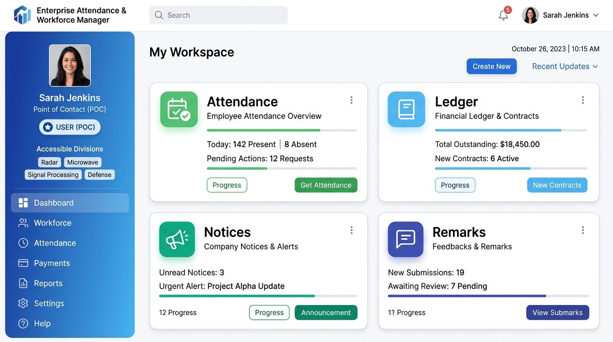
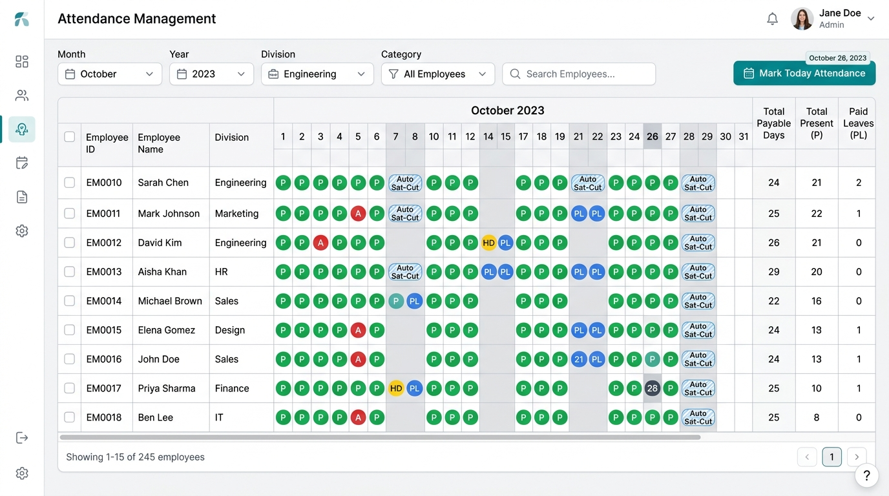
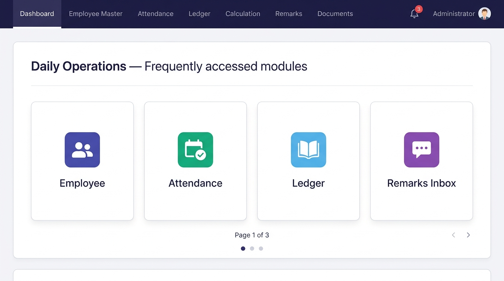
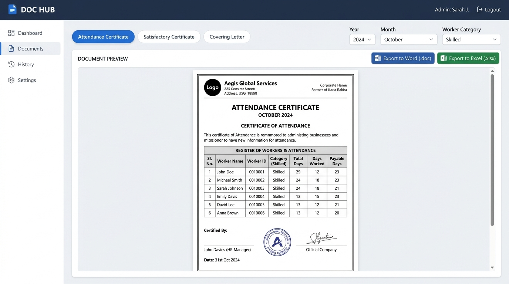

# Attendance & Workforce Management System (AMS)
## Complete User Manual: User (POC) & Administrator Perspectives

---

## 📖 Table of Contents
1. [System Overview & Authentication](#1-system-overview--authentication)
   - [1.1 About the System](#11-about-the-system)
   - [1.2 Roles and Permission Summary](#12-roles-and-permission-summary)
   - [1.3 Logging In & Domain Authentication](#13-logging-in--domain-authentication)
   - [1.4 Global Navigation & Interface Features](#14-global-navigation--interface-features)
2. [Point of Contact (POC / Regular User) Manual](#2-point-of-contact-poc--regular-user-manual)
   - [2.1 POC Workspace & Accessible Divisions](#21-poc-workspace--accessible-divisions)
   - [2.2 Daily Attendance Marking (`Attendance.aspx`)](#22-daily-attendance-marking-attendanceaspx)
   - [2.3 Understanding Half-Day Leaves & Saturday Cuts](#23-understanding-half-day-leaves--saturday-cuts)
   - [2.4 Reviewing Leave Balances & History (`Ledger.aspx`)](#24-reviewing-leave-balances--history-ledgeraspx)
   - [2.5 Submitting Attendance Correction Requests (`UserRemarks.aspx`)](#25-submitting-attendance-correction-requests-userremarksaspx)
   - [2.6 Company Notices & Circulars (`Notices.aspx`)](#26-company-notices--circulars-noticesaspx)
3. [System & HR Administrator Manual](#3-system--hr-administrator-manual)
   - [3.1 3-Page Interactive Admin Dashboard](#31-3-page-interactive-admin-dashboard)
   - [3.2 Service Provider & Contract Management (`Vendors.aspx` & `Contracts.aspx`)](#32-service-provider--contract-management-vendorsaspx--contractsaspx)
   - [3.3 Employee Master & Career Chaining (`Employee.aspx`)](#33-employee-master--career-chaining-employeeaspx)
   - [3.4 Full Attendance Control & Overrides (`Attendance.aspx`)](#34-full-attendance-control--overrides-attendanceaspx)
   - [3.5 Handling Correction Requests Inbox (`Remarks.aspx`)](#35-handling-correction-requests-inbox-remarksaspx)
   - [3.6 Month-End Calculation & Payroll Processing (`Calculation.aspx` & `Wages.aspx`)](#36-month-end-calculation--payroll-processing-calculationaspx--wagesaspx)
   - [3.7 Document Generation Hub & Word/Excel Exports (`Documents.aspx`)](#37-document-generation-hub--wordexcel-exports-documentsaspx)
   - [3.8 User Administration & Permission Scoping (`AdminManagement.aspx`)](#38-user-administration--permission-scoping-adminmanagementaspx)
   - [3.9 System Settings, Audit Logs & Undo Rollback (`Settings.aspx`)](#39-system-settings-audit-logs--undo-rollback-settingsaspx)
4. [Quick Reference, FAQs & Troubleshooting](#4-quick-reference-faqs--troubleshooting)
   - [4.1 Attendance Codes & Status Reference](#41-attendance-codes--status-reference)
   - [4.2 Permission Comparison Matrix](#42-permission-comparison-matrix)
   - [4.3 Frequently Asked Questions & Solutions](#43-frequently-asked-questions--solutions)

---

# 1. System Overview & Authentication

### 1.1 About the System
The **Attendance & Workforce Management System (AMS)** is a secure, intranet-hosted web application built for managing contract workers, tracking daily attendance, computing monthly wages, managing leave ledgers, and automatically generating formal administrative documents (such as Attendance Certificates, Satisfactory Certificates, and Covering Letters).

The system operates **100% offline within an air-gapped corporate network**, with zero dependencies on external internet services.

---

### 1.2 Roles and Permission Summary

The application distinguishes between two primary user classes:

| User Role | Target Audience | Primary Responsibilities & Access |
| :--- | :--- | :--- |
| **Point of Contact (POC / Regular User)** | Division Officers / Supervisors | • Mark and edit **today's** daily attendance for workers in assigned divisions.<br>• View leave ledgers and monthly balance sheets.<br>• Submit attendance correction requests to HR for past dates.<br>• View and download official circulars and notices. |
| **HR / System Administrator** | HR Department & System Managers | • Full administrative authority over all divisions and categories.<br>• Add and manage third-party vendors and contract terms.<br>• Maintain Employee Master records, qualifications, experience, and career chaining.<br>• Edit past attendance, override Saturday cuts, and define holidays.<br>• Review and resolve POC remarks.<br>• Process monthly wages and payroll adjustments.<br>• Configure document templates and export signed certificates to Word/Excel.<br>• Provision user roles, assign division scopes, and perform audit rollbacks. |

---

### 1.3 Logging In & Domain Authentication (`Login.aspx`)

1. Open your web browser and navigate to the application URL (e.g., `http://<server-ip>/attendence/Login.aspx`).
2. Enter your corporate **Active Directory Username** (e.g., your Windows domain ID or PCNO) and **Password**.
3. Click **Sign In**.

```
+-------------------------------------------------------------+
|                      CORPORATE LOGIN                        |
|                                                             |
|   Username:  [  user.name / PCNO        ]                   |
|   Password:  [  ••••••••••••••••        ]                   |
|                                                             |
|                  [  SIGN IN  ]                              |
|                                                             |
|   * Authenticated securely via Corporate Active Directory  |
+-------------------------------------------------------------+
```

> [!NOTE]
> **Authentication Flow**:
> - Credentials are validated against the corporate **Active Directory (LDAP)**.
> - The system automatically retrieves your official Employee ID (PCNO), Name, Designation, and Assigned Division from the HR repository.
> - If your account has been deactivated or revoked by an administrator, an *"Access Denied"* message is displayed.

---

### 1.4 Global Navigation & Interface Features

- **Side Navigation Bar (Dashboard View)**: Displays the logged-in user's profile card, official photo, designation, role badge (`USER (POC)` or `ADMINISTRATOR`), and a list of accessible divisions and categories.
- **Top Navigation Bar (Module Pages)**: Provides quick navigation links across functional areas (`Dashboard`, `Employee Master`, `Attendance`, `Ledger`, `Calculation`, `Remarks`, `Documents`).
- **Interactive Tour (`?` Icon)**: Located in the top bar. Click to initiate an automated interactive walkthrough spotlighting key interface elements.
- **Theme Switcher (`🌙` / `☀️` Icon)**: Toggle seamlessly between modern Dark Mode and Light Mode.
- **Toast Alerts**: Real-time slide-in status notifications at the top-right corner confirming save, update, or error actions.

---

# 2. Point of Contact (POC / Regular User) Manual

As a **Point of Contact (POC)**, your primary responsibility is to record and monitor daily attendance for contract workers stationed within your designated division(s).

### 2.1 POC Workspace & Accessible Divisions

Upon signing in, you are greeted by the **My Workspace** dashboard:



#### Key Dashboard Components:
1. **Profile Sidebar**: Shows your photo, PCNO, Name, Designation, and your assigned **Accessible Divisions** (e.g., *Radar, Microwave, Signal Processing*). You will only see employees belonging to these specific divisions throughout the entire application.
2. **Attendance Card**: Jump directly to the daily attendance roster.
3. **Ledger Card**: Open the monthly leave tracking and audit ledger.
4. **Notices Card**: View official notifications and download administrative circulars.
5. **Remarks Card**: View submitted attendance correction requests and submit new requests to HR.

---

### 2.2 Daily Attendance Marking (`Attendance.aspx`)

The **Attendance** page provides an interactive monthly calendar grid for tracking contract worker presence.



#### Step-by-Step: Marking Attendance for Today
1. Click **Attendance** on your dashboard or the top navigation bar.
2. Use the filter dropdowns at the top to select:
   - **Month & Year**: Select the current active month.
   - **Division**: Filter by your assigned division (or view all assigned divisions).
   - **Category**: Filter by worker category (*Skilled, Semi-Skilled, Unskilled*), or leave as *All*.
3. Click the **Mark Today Attendance** button, or click directly on **Today's date column** in the grid.
4. Set the attendance status for each employee:
   - **Present (`P`)**: Employee attended their normal shift.
   - **Absent (`A`)**: Employee did not report to work.
   - **Paid Leave (`PL`)**: Employee is absent on authorized paid leave (deducts 1 day from leave balance).
   - **Unpaid Leave (`UPL`)**: Employee is absent without paid leave credit.
   - **Half-Day (`HD`)**: Employee worked a half-day shift.
5. Click **Save Attendance** to commit the records to the database.

> [!IMPORTANT]
> **POC Current-Day Restriction**:
> Regular POC users have permission to enter and modify attendance **only for the current calendar date**. Past dates are locked for data integrity. If a past date requires modification due to an omission or error, you must submit a **Correction Request** via `UserRemarks.aspx`.

---

### 2.3 Understanding Half-Day Leaves & Saturday Cuts

#### A. Half-Day (`HD`) Leave Logic & Pairing
- When a worker takes their **first half-day** in a contract period, the system records it as a **Carried Half-Day** (`StatusValue = 1`).
- When the worker takes their **second half-day**, the system prompts you to specify whether the pair is **Paid** or **Unpaid**:
  - **Paired Paid**: Combines both half-days into 1 paid leave unit (`LeaveType = 'Paired Paid'`) and deducts 1 day from the leave balance.
  - **Paired Unpaid**: Combines both half-days as an unpaid absence (`LeaveType = 'Paired Unpaid'`).
- The system automatically notes in the remarks column: `"2 half days: DD-MMM & DD-MMM"`.

#### B. Saturday Cut Rule (`AutoSat`)
- Contract staff operate on a standard 6-day work schedule.
- If an employee is **absent on the closest working days immediately before AND after a Saturday** (e.g., Absent on Friday and Absent on Monday), the system automatically flags the Saturday as an **Auto-Saturday Cut** (`AutoSat = 1`) and treats the Saturday as an unpaid absence.
- If the employee was present on either Friday or Monday, or worked a half-day during the week, the Saturday is **not** cut.

---

### 2.4 Reviewing Leave Balances & History (`Ledger.aspx`)

The **Ledger** page provides an overview of leave consumption and remaining quotas:

```
+-----------------------------------------------------------------------------------------------+
|                                    EMPLOYEE LEAVE LEDGER                                      |
|  Filters: [ Year: 2026 ] [ Month: May ] [ Division: Radar ] [ Search Employee...          ]  |
+-----------------------------------------------------------------------------------------------+
| Sl. | ID   | Employee Name   | Category | Opening Bal | Paid Leaves | Unpaid | Balance | Present |
+-----+------+-----------------+----------+-------------+-------------+--------+---------+---------+
| 1   | S-1  | Ramesh Kumar    | Skilled  | 12.0        | 2.0         | 0.0    | 10.0    | 24      |
| 2   | S-2  | Suresh Naik     | Skilled  | 8.0         | 1.0         | 1.0    | 7.0     | 25      |
| 3   | SS-1 | Anita Rao       | Semi-Sk  | 15.0        | 0.0         | 0.0    | 15.0    | 26      |
+-----------------------------------------------------------------------------------------------+
```

1. Select the **Month & Year** range you want to audit.
2. View the tabulated metrics:
   - **Opening Balance**: Leave balance brought forward from the preceding month.
   - **Paid Leaves Taken**: Total authorized paid leave days utilized in the selected month.
   - **Unpaid Absences**: Days absent without pay.
   - **Closing / Remaining Balance**: Current available paid leave balance.
   - **Total Present Days**: Days physically worked.
3. Unused leaves automatically carry forward to the next month.

---

### 2.5 Submitting Attendance Correction Requests (`UserRemarks.aspx`)

If an attendance entry for a **past date** was marked incorrectly (e.g., an employee was marked absent when they were on duty or submitted a valid medical slip):

1. Navigate to **Remarks** (`UserRemarks.aspx`).
2. Click **Submit New Remark / Correction Request**.
3. Fill out the request form:
   - **Employee**: Select the worker from the dropdown.
   - **Target Date**: Pick the specific past date that requires correction.
   - **Requested Status**: Select the correct status (e.g., *Present*, *Paid Leave*).
   - **Reason / Description**: Provide a clear explanation (e.g., *"Worker attended official field duty at Outstation Site on 12-May"*).
4. Click **Submit Request**.
5. The request is instantly routed to the HR Administrator's inbox (`Remarks.aspx`). You can monitor whether HR has reviewed or resolved the request in your sent remarks table.

---

### 2.6 Company Notices & Circulars (`Notices.aspx`)

1. Click **Notices** in the navigation menu.
2. Review company circulars, holiday schedules, administrative orders, and policy announcements.
3. Click **Download / View** to open attached PDF or Word files.

---

# 3. System & HR Administrator Manual

As an **Administrator** or **Super Admin**, you have unrestricted access to all organizational divisions, master records, payroll calculations, system settings, and document generation workflows.

### 3.1 3-Page Interactive Admin Dashboard

The Admin Dashboard is organized into three single-row carousel pages:



#### Carousel Pages Overview:
- **Page 1: Daily Operations**
  - **Employee**: Worker master records, engagements, and leave balances.
  - **Attendance**: Global attendance calendar with unrestricted back-date editing.
  - **Ledger**: Organization-wide leave auditing and balance ledgers.
  - **Remarks Inbox**: Inbox for reviewing and resolving POC correction requests.
- **Page 2: Periodic Tasks & Notices**
  - **Calculation**: Monthly wage processing and manual day additions/deductions.
  - **Documents**: Template generator for Word/Excel certificates and covering letters.
  - **Notices**: Publishing administrative announcements and file uploads.
- **Page 3: System Administration**
  - **Admin Management**: User onboarding, role assignment, and division mapping.
  - **Settings**: System categories, divisions, audit logs, and transaction undo.
  - **Service Provider Master Card** *(Slides into sub-cards)*:
    - **Vendors**: Third-party manpower agency registry.
    - **Contracts**: 2-year contract period configuration and GeM contract IDs.
    - **Wages & Statutory**: Minimum wage rates, EPF caps, and statutory percentages.

> [!TIP]
> **Dashboard Navigation Tips**:
> - Use your **Mouse Scroll Wheel** anywhere on the dashboard card container to smoothly transition between pages.
> - Use **Left / Right Keyboard Arrow Keys** to switch pages.
> - Click the **Pagination Dots** at the bottom of the card panel to jump directly to any page.
> - On mobile/tablet devices, swipe left or right.

---

### 3.2 Service Provider & Contract Management (`Vendors.aspx` & `Contracts.aspx`)

#### A. Managing Vendors (`Vendors.aspx`)
1. Click **Service Provider** on Page 3 $\rightarrow$ select **Vendors**.
2. **Add New Vendor**: Enter Agency Name, Agency Master ID, GeM ID, Contact Person, Phone, and Address.
3. **Deactivate Vendor**: If a vendor's contract concludes, toggle **Active Status** to *Inactive* (`IsActive = 0`). The system maintains historical records and prevents hard deletion to preserve data integrity.
4. **Transaction History**: Click on any vendor to view all past contracts awarded and historical worker counts.

#### B. Managing Contract Periods (`Contracts.aspx`)
Contracts define the official operating terms (typically 2 years) between a vendor agency and a skill category (*Skilled, Semi-Skilled, Unskilled*).

1. Click **Contracts** from the Service Provider sub-panel.
2. **Create New Contract**:
   - Select **Vendor Agency** and **Skill Category**.
   - Enter **Start Date** and **End Date** (defaults to a 2-year period).
   - Enter the **GeM Contract Order Number** and **Contract Date**.
   - **Initialize Leaves**: Specify the starting leave balance credited to workers under this contract period (e.g., 15 days).
3. **Contract Extensions**: To extend an active contract, click **Extend Contract**, enter the new end date, and save. The change is logged in `ContractExtensions`.
4. **Automatic 5-Second Contract Expiry Routine**:
   - The system background engine automatically checks for expired contracts upon database access.
   - When a contract's end date passes, its status is set to `'Closed'`.
   - All worker stints under that contract are finalized with `EndReason = 'ContractEnd'`, and employee records are placed in `'ContractEnded'` status.
   - Historical attendance and wage data under closed contracts are **sealed and immutable**.

---

### 3.3 Employee Master & Career Chaining (`Employee.aspx`)

The **Employee Master** is the central repository for all contract workforce profiles.

```
+-------------------------------------------------------------------------------------------------+
|                                     EMPLOYEE MASTER ROSTER                                      |
|  [ + Add New Employee ]   [ 📥 Add Bulk Leaves ]   [ 🔍 Search by Name, Qualification, Exp... ] |
+-------------------------------------------------------------------------------------------------+
| Master ID | Display ID | Employee Name | Category | Division | Status   | Qualification | Exp   |
+-----------+------------+---------------+----------+----------+----------+---------------+-------+
| EMP-101   | S-1        | Rajesh M      | Skilled  | Radar    | Active   | B.E. (ECE)    | 4 Yrs |
| EMP-102   | S-2        | Priya Sharma  | Skilled  | Micro    | Active   | Diploma (EEE) | 2 Yrs |
| EMP-103   | SS-1       | Kiran Kumar   | Semi-Sk  | Signal   | Active   | ITI (Fitter)  | 1 Yr  |
+-------------------------------------------------------------------------------------------------+
```

#### Key Capabilities:
1. **Dynamic Category IDs**: Each worker possesses a permanent database `MasterId` (e.g., `EMP-101`), while category display codes (`S-1`, `SS-5`, `US-12`) are generated dynamically based on active skill level.
2. **Career Stint Tracking**: When an employee is upgraded (e.g., from *Semi-Skilled* to *Skilled*) or transferred across divisions:
   - The current engagement in `EmployeeEngagements` is formally closed with an end date and reason.
   - A new engagement stint is opened and linked to the worker's continuous career chain.
3. **Rejoining Former Workers**: If a resigned worker rejoins the organization under a new contract:
   - Click **Rejoin Employee**.
   - Select their existing profile to attach the new engagement stint without losing historical attendance or prior service records.
4. **Annual Bulk Leave Addition**:
   - At the beginning of a new contract year, click **Add Bulk Leave**.
   - Select the effective date and specify the number of leave credits to add to all active workers.
5. **Advanced Filter Search**: Filter the entire workforce by **Skill Category**, **Division**, **Status**, **Educational Qualification**, and **Years of Experience**.

---

### 3.4 Full Attendance Control & Overrides (`Attendance.aspx`)

As an Administrator, you have complete authority to view and adjust attendance for any date:

1. **Modify Any Date**: Double-click on any cell in the calendar grid to change status (`P`, `A`, `PL`, `UPL`, `HD`).
2. **Overriding Auto-Saturday Cuts**:
   - If an employee has an `AutoSat` cut due to Friday/Monday absences, but had valid management approval:
   - Right-click the Saturday cell $\rightarrow$ select **Override Saturday Cut**.
   - Enter the override justification (e.g., *"Authorized compensatory off"*).
   - The system changes `AutoSat` to `0` and credits the day as payable.
3. **Public Holiday Marking**:
   - Click **Holiday Management** $\rightarrow$ select the calendar date and enter the Holiday Name (e.g., *Independence Day*).
   - If contract personnel worked on the holiday, mark them as **Present (`1`)** with a duty remark.
4. **Global Payable Days Adjustment**:
   - Manually adjust an employee's total payable days to enforce minimum baseline rules or apply administrative adjustments.

---

### 3.5 Handling Correction Requests Inbox (`Remarks.aspx`)

When a POC submits a correction request, a notification badge appears on the top bar's bell icon:

1. Click the **Notification Bell** or open **Remarks Inbox** (`Remarks.aspx`).
2. View pending requests showing Submitter Name, Employee Name, Target Date, Requested Change, and Justification.
3. Click **Review & Apply**:
   - The system opens the target attendance cell.
   - Apply the requested correction (e.g., change Absent to Present).
   - Click **Mark as Resolved / Approved**.
4. The POC receives an updated status in their sent remarks view.

---

### 3.6 Month-End Calculation & Payroll Processing (`Calculation.aspx` & `Wages.aspx`)

#### A. Configuring Statutory Wages (`Wages.aspx`)
Configure category minimum wage orders, Basic rates, Variable Dearness Allowance (VDA), EPF caps, and ESI percentages.

#### B. Processing Monthly Wages (`Calculation.aspx`)
At the end of each billing cycle:
1. Select **Year**, **Month**, and **Category** (*Skilled, Semi-Skilled, Unskilled*).
2. The system compiles the attendance summary and displays:
   - **Base Days Worked**: Actual physically worked days.
   - **Paid Leaves**: Authorized paid leave credits.
   - **Saturday Credits**: Saturday days eligible for pay.
   - **Computed Payable Days**: Total days payable before overrides.
3. **Day Adjustments (+ / - Days)**:
   - Enter manual additions (`+1.0`, `+2.0`) or deductions (`-1.0`) in the adjustment column to resolve prior billing arrears or penalties.
4. **Final Wage Calculation Formula**:
   $$\text{Final Monthly Wage} = (\text{Computed Payable Days} + \text{Day Adjustments}) \times \text{Daily Wage Rate}$$
5. Click **Save & Lock Payroll Statement**.

---

### 3.7 Document Generation Hub & Word/Excel Exports (`Documents.aspx`)

The Document Hub creates formatted, audit-ready compliance certificates and transmittal letters in seconds:



#### Available Document Types:
1. **Attendance Certificate**: Tabulates monthly workforce attendance, payable days, paid/unpaid leaves, and Saturday cuts.
2. **Satisfactory Certificate**: Formal performance certificate certifying that the vendor supplied contracted manpower satisfactorily.
3. **Covering Letter**: Transmittal letter addressed to Accounts / Purchase departments authorizing invoice clearance.

#### Step-by-Step Generation:
1. Select the document type tab (*Attendance Certificate*, *Satisfactory Certificate*, or *Covering Letter*).
2. Select **Year**, **Month**, and **Category**.
3. **Dynamic Template Placeholders**:
   Templates automatically resolve dynamic data fields in real-time:
   - `{VendorName}` $\rightarrow$ Contracting Agency Name
   - `{Category}` $\rightarrow$ Skilled / Semi-Skilled / Unskilled
   - `{ContractNo}` $\rightarrow$ GeM Contract Reference Number
   - `{StartDate}` & `{EndDate}` $\rightarrow$ Monthly billing period
   - `{EmpCount}` $\rightarrow$ Total active workers deployed
   - `{DatedOn}` $\rightarrow$ Current date
4. **Dynamic Signatory Lookup**: Select the certifying authority by their corporate PCNO; the system automatically populates their Name, Official Title, and Department.
5. **Export Formats**:
   - Click **Export to Word (`.doc`)**: Compiles the document with official letterhead formatting, single-line paragraph structures, and standard 1-inch print margins.
   - Click **Export to Excel (`.xlsx`)**: Compiles styled Excel workbooks using SheetJS, complete with custom column widths, text-wrapping, and bold header blocks.

---

### 3.8 User Administration & Permission Scoping (`AdminManagement.aspx`)

Super Administrators can onboard corporate staff and configure access rights:

```
+----------------------------------------------------------------------------------------------+
|                                    ADMIN MANAGEMENT HUB                                      |
|  [ + Register New User ]                                                                     |
+----------------------------------------------------------------------------------------------+
| PCNO | Name          | Designation       | System Role       | Assigned Divisions   | Status |
+------+---------------+-------------------+-------------------+----------------------+--------+
| 1042 | Sarah Jenkins | Senior Scientist  | User (POC)        | Radar, Microwave     | Active |
| 1018 | David Sharma  | Technical Officer | Administrator     | All Divisions Access | Active |
| 1099 | Rajesh Verma  | Admin Assistant   | Revoked           | None                 | Locked |
+----------------------------------------------------------------------------------------------+
```

1. **Add User**:
   - Enter the user's Active Directory **PCNO**.
   - Assign their **System Role**:
     - `0` = Regular User (POC)
     - `1` = System Administrator
     - `4` = Super Administrator
2. **Assign Division Scopes (`UserDivisions`)**:
   - Select one or more organizational divisions for POC users. The user will be restricted to viewing and managing only those divisions.
3. **Assign Category Scopes (`UserTiers`)**:
   - Map accessible skill tiers (*Skilled, Semi-Skilled, Unskilled*) to the user.
4. **Revoke Access**: Set role to *Revoked* (`2` or `3`) to immediately disable system access.

---

### 3.9 System Settings, Audit Logs & Undo Rollback (`Settings.aspx`)

1. **Organization Units**: Add or edit organizational divisions, skill categories, and tier hierarchies.
2. **Comprehensive Audit Logs**: Every state change (employee profile edit, status promotion, transfer, or attendance alteration) is serialized into `EmployeeActionLogs` capturing pre-modification and post-modification states.
3. **One-Click Transaction Undo**:
   - If an accidental promotion, downgrade, or division transfer occurred:
   - Locate the transaction in the **Recent Transitions Log**.
   - Click the **Undo Transaction** button.
   - The system automatically restores the previous database state and re-aligns engagement stints.

---

# 4. Quick Reference, FAQs & Troubleshooting

### 4.1 Attendance Codes & Status Reference

| Status Code | Status Name | Color Pill | Impact on Paid Balance | Impact on Monthly Wage |
| :--- | :--- | :--- | :--- | :--- |
| **`P`** | Present | 🟢 Green | None | +1.0 Payable Day |
| **`A`** | Absent | 🔴 Red | None | 0.0 Days (Unpaid) |
| **`PL`** | Paid Leave | 🔵 Blue | Deducts 1.0 Day | +1.0 Payable Day |
| **`UPL`** | Unpaid Leave | ⚪ Gray | None | 0.0 Days (Unpaid) |
| **`HD`** | Half-Day (1st) | 🟡 Yellow | None (Carried) | +1.0 Day temporarily |
| **`P-PL`** | Paired Half-Day Paid | 🔵 Blue Pill | Deducts 1.0 Day (for pair) | +1.0 Payable Day |
| **`P-UPL`** | Paired Half-Day Unpaid | 🔴 Red Pill | None | 0.0 Days (Unpaid) |
| **`AutoSat`** | Auto Saturday Cut | 🟣 Striped | None | Cut to 0.0 Days |

---

### 4.2 Permission Comparison Matrix

| System Feature / Action | Point of Contact (POC) | HR / System Admin |
| :--- | :---: | :---: |
| **Mark Today's Attendance** | ✅ Yes (Assigned Divs) | ✅ Yes (All Divs) |
| **Edit Past Dates Attendance** | ❌ No (Read-Only) | ✅ Yes (Unrestricted) |
| **Override Saturday Cuts** | ❌ No | ✅ Yes |
| **Submit Correction Requests** | ✅ Yes (`UserRemarks.aspx`) | N/A |
| **Review & Resolve Remarks** | ❌ No | ✅ Yes (`Remarks.aspx`) |
| **View Leave Ledger** | ✅ Yes (Assigned Divs) | ✅ Yes (All Divs) |
| **Manage Vendors & Contracts** | ❌ No | ✅ Yes |
| **Manage Employee Profiles** | ❌ No | ✅ Yes |
| **Process Payroll & Wage Calculation**| ❌ No | ✅ Yes |
| **Generate Word/Excel Certificates** | ❌ No | ✅ Yes |
| **User Role & Division Provisioning**| ❌ No | ✅ Yes |
| **Audit Log Rollback (Undo)** | ❌ No | ✅ Yes |

---

### 4.3 Frequently Asked Questions & Solutions

#### Q1: Why cannot I edit attendance for yesterday on the Attendance page?
> **Answer**: By system security policy, regular POC users are restricted to entering and modifying attendance for **today's date only**. To rectify past discrepancies, navigate to **Remarks** (`UserRemarks.aspx`), select the date and employee, and submit a correction request to HR.

#### Q2: Why is a worker's Saturday marked as "Auto-Saturday Cut"?
> **Answer**: If an employee is marked absent on both the closest working days before and after a Saturday (e.g., Friday and Monday), the system applies the automatic Saturday Cut rule. If the absence was authorized, an Administrator can right-click the Saturday cell in `Attendance.aspx` and select **Override Saturday Cut**.

#### Q3: How do I export an Attendance Certificate to Microsoft Word or Excel?
> **Answer**: Administrators can navigate to **Documents** (`Documents.aspx`), select the desired **Year**, **Month**, and **Category**, and click either **Export to Word (`.doc`)** or **Export to Excel (`.xlsx`)**. The download will initiate immediately in your browser.

#### Q4: What happens when a 2-year contract period reaches its end date?
> **Answer**: The system automatically closes expired contract periods, finalizes active worker stints, and transitions employees to `'ContractEnded'` status. All historical records for that period are sealed for compliance. When a new contract is awarded, create the new period in `Contracts.aspx` and enroll or rejoin the workers.

---
*Attendance & Workforce Management System (AMS) — Official User & Administrator Handbook (2026)*
