# Software Requirements Specification (SRS)

## for

# Attendance & Contract Workforce Management System

**Version 2.0**  
**Date:** July 2026  

---

## Table of Contents

1. [Introduction](#1-introduction)  
   1.1 [Purpose](#11-purpose)  
   1.2 [Document Conventions](#12-document-conventions)  
   1.3 [Intended Audience and Reading Suggestions](#13-intended-audience-and-reading-suggestions)  
   1.4 [Product Scope](#14-product-scope)  
   1.5 [References](#15-references)  

2. [Overall Description](#2-overall-description)  
   2.1 [Product Perspective](#21-product-perspective)  
   2.2 [Product Functions](#22-product-functions)  
   2.3 [User Classes and Characteristics](#23-user-classes-and-characteristics)  
   2.4 [Operating Environment](#24-operating-environment)  
   2.5 [Design and Implementation Constraints](#25-design-and-implementation-constraints)  
   2.6 [User Documentation](#26-user-documentation)  
   2.7 [Assumptions and Dependencies](#27-assumptions-and-dependencies)  

3. [System Features and Requirements](#3-system-features-and-requirements)  
   3.1 [Authentication and Authorization Module](#31-authentication-and-authorization-module)  
   3.2 [Dashboard Module](#32-dashboard-module)  
   3.3 [Employee Master Module](#33-employee-master-module)  
   3.4 [Vendor Management Module](#34-vendor-management-module)  
   3.5 [Contract Management Module](#35-contract-management-module)  
   3.6 [Attendance Management Module](#36-attendance-management-module)  
   3.7 [Calculation / Payroll Module](#37-calculation--payroll-module)  
   3.8 [Ledger Module](#38-ledger-module)  
   3.9 [Document Generation Module](#39-document-generation-module)  
   3.10 [Notices Module](#310-notices-module)  
   3.11 [Remarks / Correction Request Module](#311-remarks--correction-request-module)  
   3.12 [Admin / User Management Module](#312-admin--user-management-module)  
   3.13 [Settings Module](#313-settings-module)  

4. [External Interface Requirements](#4-external-interface-requirements)  
   4.1 [User Interfaces](#41-user-interfaces)  
   4.2 [Hardware Interfaces](#42-hardware-interfaces)  
   4.3 [Software Interfaces](#43-software-interfaces)  
   4.4 [Communications Interfaces](#44-communications-interfaces)  

5. [Non-Functional Requirements](#5-non-functional-requirements)  
   5.1 [Performance Requirements](#51-performance-requirements)  
   5.2 [Security Requirements](#52-security-requirements)  
   5.3 [Software Quality Attributes](#53-software-quality-attributes)  

6. [Database Architecture and Design](#6-database-architecture-and-design)  
   6.1 [Schema Overview](#61-schema-overview)  
   6.2 [Entity-Relationship Diagram](#62-entity-relationship-diagram)  
   6.3 [Table Descriptions and Relationships](#63-table-descriptions-and-relationships)  
   6.4 [Key Business Logic in Database](#64-key-business-logic-in-database)  

7. [System Architecture](#7-system-architecture)  
   7.1 [Architecture Overview](#71-architecture-overview)  
   7.2 [Technology Stack](#72-technology-stack)  
   7.3 [Module Interaction Flow](#73-module-interaction-flow)  

8. [Glossary](#8-glossary)  

9. [Appendices](#9-appendices)  

---

## 1. Introduction

### 1.1 Purpose

This Software Requirements Specification (SRS) document describes the complete functional and non-functional requirements for the **Attendance & Contract Workforce Management System**. This system is developed to manage contract-based employees in an organization, handling their attendance tracking, leave management, wage/salary calculation, document generation, and contract lifecycle management. The system will be deployed in a company environment with no internet connectivity and will operate entirely on an intranet.

### 1.2 Document Conventions

- **SHALL / MUST** — Indicates a mandatory requirement.
- **SHOULD** — Indicates a recommended requirement.
- **MAY** — Indicates an optional requirement.
- **Bold text** — Highlights key terms and important concepts.
- `Monospace text` — Denotes code, SQL queries, table names, and file paths.
- All Mermaid diagrams are rendered from ``mermaid`` code blocks.

### 1.3 Intended Audience and Reading Suggestions

This document is intended for:
- **Project stakeholders** — To understand system capabilities and scope.
- **Development team** — To implement features according to specifications.
- **Quality assurance team** — To create test plans and test cases.
- **System administrators** — To understand deployment and configuration requirements.
- **End users (HR administrators and POCs)** — To understand system functionality.

### 1.4 Product Scope

The **Attendance & Contract Workforce Management System** is a web-based application that manages the complete lifecycle of contract/outsourced employees in an organization. The system:

- Tracks daily attendance for contract employees across multiple divisions/departments.
- Manages employee categories (Skilled, Semi-Skilled, Unskilled) with upgrade/downgrade capabilities.
- Handles contract periods with vendors, including contract extensions.
- Computes wages based on attendance with support for manual overrides.
- Generates official documents (Attendance Certificates, Satisfactory Certificates, Covering Letters, Wage Calculation reports).
- Provides a ledger view of employee leave balances and attendance summaries.
- Supports two user roles: **Admin (HR)** with full access and **Regular User (POC)** with division-restricted access.
- Manages employee history including resignations, re-joining, transfers, and category changes with full undo support.

The system is currently being used with **approximately 80 employees** across **30 divisions** and will scale to support the organization's contract workforce needs.

### 1.5 References

| Reference | Description |
|-----------|-------------|
| IEEE Std 830-1998 | IEEE Recommended Practice for Software Requirements Specifications |
| Oracle Database 11g Documentation | Oracle SQL and PL/SQL Reference |
| ASP.NET 4.5 Documentation | Microsoft .NET Framework Documentation |
| Active Directory / LDAP Integration | Microsoft Directory Services Documentation |

---

## 2. Overall Description

### 2.1 Product Perspective

The system is an **ASP.NET Web Forms application** designed for an **intranet-only environment**. It replaces manual paper-based attendance tracking and spreadsheet-based wage calculation with a centralized digital system.

**System Context Diagram:**

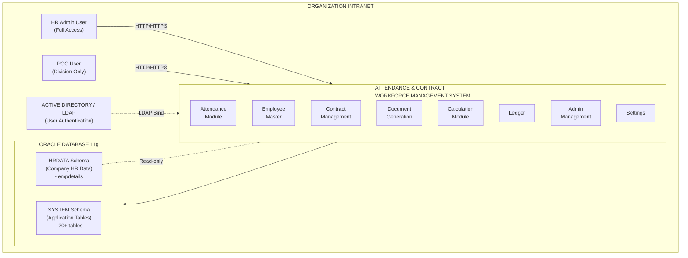

### 2.2 Product Functions

The major functions of the system are:

| # | Function | Description |
|---|----------|-------------|
| 1 | **User Authentication** | LDAP/Active Directory-based login with fallback to database authentication. Users authenticate using their company PCNO (Personnel Number) and network password. |
| 2 | **Attendance Management** | Monthly grid-based attendance marking. Supports Present (1), Absent (0), Half-Day (0.5), Paid Leave, Unpaid Leave, Holiday marking. Includes automatic Saturday logic and global adjustment. |
| 3 | **Employee Master** | Complete employee registry with MasterId, personal details, qualifications, experience, leave balances. Supports import via CSV, re-joining with history, category upgrades/downgrades, division transfers, and complete employee deletion. |
| 4 | **Vendor Management** | Manages manpower agencies/contractors. Supports vendor creation, editing, deactivation, and full contract history viewing. Vendors have MasterId (e.g., VND001). |
| 5 | **Contract Management** | Manages contract periods per category per vendor. Supports new contract creation with employee enrollment, contract extension, early termination, and deletion with full cascading rollback. Contract periods are typically 2 years with extension support. |
| 6 | **Wage Calculation** | Monthly wage calculation based on attendance. Supports category-specific wage rates, manual override of present days per employee, and global adjustment. |
| 7 | **Document Generation** | Generates Attendance Certificates, Satisfactory Certificates, Covering Letters, and Wage Calculation reports in various formats. Templates are customizable via Settings. Uses placeholder presets (e.g., {VendorName}, {ContractNo}) for dynamic data. Invoice.aspx is not used; all documents are managed through Documents.aspx. |
| 8 | **Ledger** | Comprehensive monthly view showing opening/closing leave balances, paid/unpaid leave counts, half-day deductions, Saturday cuts, present days, and all remarks for each employee. |
| 9 | **Notice Board** | Admin can upload, hide/show official notices and documents. |
| 10 | **Remarks / Correction Requests** | Regular users (POCs) can submit attendance correction requests to admin. Admin receives notifications and can view/manage remarks. |
| 11 | **Admin Management** | Create/manage admin and regular user accounts. Assign division-level access to regular users. Revoke/grant user access. |
| 12 | **Settings** | Manage divisions, categories, certificate templates, database backup/restore, and undo manager for rolling back employee actions. |
| 13 | **Dashboard** | Summary view showing key metrics, statistics, and recent activity. |

### 2.3 User Classes and Characteristics

| User Class | Role Value | Description | Access Rights |
|------------|-----------|-------------|---------------|
| **Admin (HR)** | `Role = 1` | HR department personnel responsible for overall system management. | Full access to all modules. Can edit attendance for any date. Can override Saturdays. Can manage employees, vendors, contracts, and all settings. |
| **Regular User (POC)** | `Role = 0` | Point of Contact (POC) personnel who oversee contract employees within specific divisions. | Access restricted to assigned divisions. Can mark attendance for current day only. Can view Ledger (division-restricted), Notices, and submit remarks to admin. Cannot override Saturday attendance. Cannot modify previous attendance data. |
| **Revoked Admin** | `Role = 2` | Former admin whose access has been revoked. | Cannot log in. |
| **Revoked User** | `Role = 3` | Former regular user whose access has been revoked. | Cannot log in. |

### 2.4 Operating Environment

| Component | Environment |
|-----------|-------------|
| **Server OS** | Windows Server (compatible with IIS) |
| **Web Server** | Internet Information Services (IIS) |
| **Target Framework** | .NET Framework 4.5 |
| **Database** | Oracle Database 11g (primary). MySQL was used only for local testing by the developer and is NOT part of the production system. |
| **Development IDE** | Visual Studio 2015 |
| **Client Browser** | Modern browsers (Chrome, Firefox, Edge) on the intranet |
| **Authentication** | Active Directory / LDAP (intranet) |
| **Network** | Intranet-only — no internet connectivity required |

### 2.5 Design and Implementation Constraints

- **No internet access:** The application and all its dependencies must operate entirely within the company intranet.
- **Oracle 11g compatibility:** All database operations must use Oracle 11g-compatible syntax. `GENERATED ALWAYS AS IDENTITY` (Oracle 12c+) is NOT used. Instead, sequences + BEFORE INSERT triggers are used for auto-increment.
- **.NET Framework 4.5:** The application targets .NET 4.5 (Visual Studio 2015 compatible).
- **Intranet deployment:** LDAP path and database connection strings must be configurable via `Web.config` for different deployment environments.
- **Schema separation:** The company HR data (`hrdata.empdetails`) resides in a separate schema and is treated as read-only. The application's own tables reside in the `SYSTEM` schema.
- **No external CDNs:** All JavaScript libraries and CSS frameworks must be bundled locally (e.g., `Static/` folder contains bootstrap.min.css, angular.min.js, xlsx.full.min.js, fontawesome-free, sb-admin-2.min.css).

### 2.6 User Documentation

The user documentation will include:
- This SRS document
- Database documentation (see `example/database_documentation.md`)
- User manual (to be created)
- Administrator guide (to be created)

### 2.7 Assumptions and Dependencies

- **Active Directory availability:** The system assumes an Active Directory server is available on the intranet for user authentication. The AD server's LDAP path is configured in `Web.config`.
- **Company HR database:** The system assumes the existence of an `hrdata.empdetails` table (in a separate schema) containing employee PCNO, NAME, DESIGNATION, and DIVNAME for all company employees.
- **Oracle Database:** The system requires an Oracle 11g (or higher) database instance.
- **Browser compatibility:** The frontend uses Bootstrap 4.x, AngularJS, and standard HTML5/CSS3, requiring a modern browser.
- **Printer access:** Document generation (Satisfactory Certificates, etc.) requires access to a printer for physical copies.

---

## 3. System Features and Requirements

### 3.1 Authentication and Authorization Module

#### 3.1.1 Description

The system authenticates users via **Active Directory / LDAP**. After successful AD authentication, the user's PCNO is matched against the `AppUsers` table to determine their role and access permissions.

#### 3.1.2 Functional Requirements

| ID | Requirement | Priority |
|----|-------------|----------|
| REQ-AUTH-01 | The system SHALL authenticate users against Active Directory using their PCNO (Personnel Number) as username and their network password. | High |
| REQ-AUTH-02 | After successful AD authentication, the system SHALL query the `AppUsers` table to determine the user's `Role` (0=Regular User, 1=Admin, 2=Revoked Admin, 3=Revoked User). | High |
| REQ-AUTH-03 | Users with Role 2 or 3 SHALL be denied access with an appropriate message. | High |
| REQ-AUTH-04 | The system SHALL query `hrdata.empdetails` to fetch the user's display name, designation, and division for session data. If not found, it SHALL fall back to the name stored in `AppUsers`. | High |
| REQ-AUTH-05 | For Regular Users, the system SHALL load their allowed divisions from `UserDivisions` table and store them in the session. | High |
| REQ-AUTH-06 | The system SHALL use Forms Authentication with a 1440-minute (24 hour) session timeout. | High |

#### 3.1.3 Login Flow Diagram

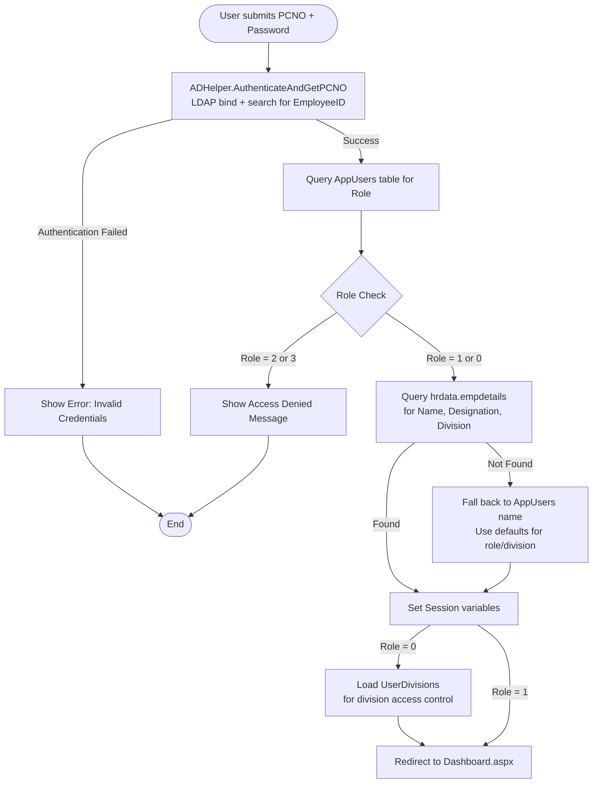

### 3.2 Dashboard Module

#### 3.2.1 Description

The Dashboard provides a summary view of system-wide statistics and metrics. The content may differ based on user role.

#### 3.2.2 Functional Requirements

| ID | Requirement | Priority |
|----|-------------|----------|
| REQ-DASH-01 | The dashboard SHALL display summary statistics (employee counts, attendance status, etc.). | Medium |
| REQ-DASH-02 | The dashboard SHALL be accessible to all authenticated users. | High |
| REQ-DASH-03 | For non-admin users, the dashboard SHALL only show data relevant to their assigned divisions. | Medium |

### 3.3 Employee Master Module

#### 3.3.1 Description

The Employee Master is the central registry for all contract workers. It maintains complete employee information, employment history, leave balances, and status tracking. Each employee is assigned a unique **MasterId** (permanent identifier) that never changes.

#### 3.3.2 Functional Requirements

| ID | Requirement | Priority |
|----|-------------|----------|
| REQ-EMP-01 | The system SHALL maintain a unique **MasterId** for each employee that persists across engagements, contracts, and re-joinings. | High |
| REQ-EMP-02 | The system SHALL support adding employees individually via a form with the following fields: ID, Name, Department, Category, Join Date, Leave Balance, Prev Leave Balance, Phone, Email, Aadhar, Address, Qualification, Experience, Experience In. | High |
| REQ-EMP-03 | The system SHALL support bulk import of employees via CSV file upload with columns for ID, Name, Department, Join Date, Leave Balance, Qualification, Experience, Experience In, Phone, Email, Aadhar, Address. | High |
| REQ-EMP-04 | The system SHALL support **advanced filters** for searching employees based on: Category, Division (Department), Status (Active/Resigned/Upgraded/Downgraded/Transferred/ContractEnded), Name/ID search, and Qualification/Experience search. | High |
| REQ-EMP-05 | The system SHALL support editing employee details. | High |
| REQ-EMP-06 | The system SHALL support **complete deletion of an employee** (all associated records including attendance, engagements, overrides, and action logs). | High |
| REQ-EMP-07 | The system SHALL support **employee re-joining**: When a resigned employee is re-added, the system SHALL present an option to select "Is Rejoining" and display a dropdown of previously resigned employees. Upon re-joining, the old MasterId is retained and historical data (attendance, engagements) is preserved. The `OriginalJoinDate` remains unchanged; `JoinDate` is updated to the new start date. | High |
| REQ-EMP-08 | The system SHALL maintain **employee history**: All changes including upgrades, downgrades, transfers, resignations, and re-joinings SHALL be recorded in `EmployeeActionLogs` with before/after state snapshots (JSON). | High |
| REQ-EMP-09 | The system SHALL support **employee upgrade/downgrade** between categories (Unskilled ↔ Semi-Skilled ↔ Skilled). | High |
| REQ-EMP-10 | The system SHALL support **employee transfer** between divisions/departments. | High |
| REQ-EMP-11 | The system SHALL support **bulk leave addition**: Admin can add leave balance to multiple employees at once by specifying the effective date, leave amount, remarks, and optionally filtering by category and division. | High |
| REQ-EMP-12 | The system SHALL support **leave balance reset**: Admin can reset all employees' leave balances to zero with a single operation, recording the effective date and remarks. | Medium |
| REQ-EMP-13 | When adding an employee for a new contract, the system SHALL support setting a fresh **leave balance** for the contract year. After one year, admin can add additional leave via bulk leave option specifying a new effective date from which the new balance applies. | High |
| REQ-EMP-14 | The system SHALL support viewing **resigned employees** in a separate tab, with the ability to filter and search. | Medium |

#### 3.3.3 Employee Status Flow

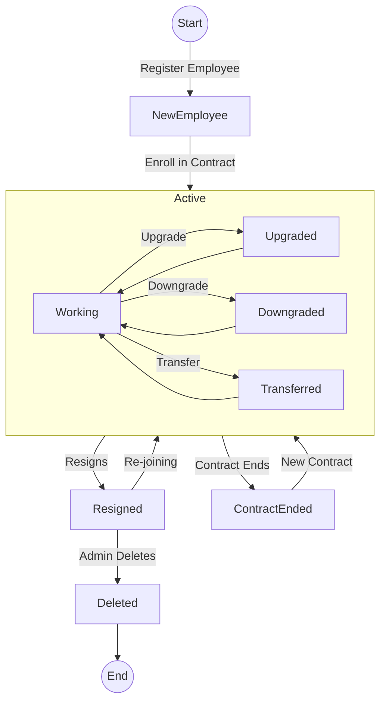

### 3.4 Vendor Management Module

#### 3.4.1 Description

Manages manpower agencies/contractors who supply contract employees. Each vendor has a unique **MasterId** (e.g., VND001).

#### 3.4.2 Functional Requirements

| ID | Requirement | Priority |
|----|-------------|----------|
| REQ-VEN-01 | The system SHALL allow admin to add, edit, and deactivate vendors with fields: MasterId (auto-generated like VND001), Name, GeM ID, Contact Name, Contact Phone, Address. | High |
| REQ-VEN-02 | The system SHALL auto-generate the Vendor MasterId using the format `VND` + incrementing number (e.g., VND001, VND002). | High |
| REQ-VEN-03 | The system SHALL support vendor search by MasterId, Name, or GeM ID. | Medium |
| REQ-VEN-04 | The system SHALL support **vendor history viewing**: Admin can view the complete contract timeline for a vendor, including all contract periods, extensions, and the number of employees supplied per period. | High |
| REQ-VEN-05 | Vendors with active contracts SHALL be deactivated (not deleted) to preserve data integrity. Vendors with no references MAY be completely deleted. | Medium |

### 3.5 Contract Management Module

#### 3.5.1 Description

Manages the lifecycle of formal contract periods between the organization and vendors for supplying contract workers of specific categories. Contracts are typically for **2 years** with extension options.

#### 3.5.2 Functional Requirements

| ID | Requirement | Priority |
|----|-------------|----------|
| REQ-CON-01 | The system SHALL allow admin to create a new contract period by selecting Category, Vendor, specifying GeM ID, Start Date, End Date, and Dated On date. | High |
| REQ-CON-02 | The system SHALL prevent creating a new active contract for a category if another active contract already exists for that category. The current contract must be ended first. | High |
| REQ-CON-03 | During contract creation, the system SHALL provide a wizard-based process to enroll employees from the previous contract period (carry-over) or newly registered employees. | High |
| REQ-CON-04 | The system SHALL support **contract extension**: Admin can extend a contract's end date. The extension is recorded in `ContractExtensions` table with old end date, new end date, and extension timestamp. | High |
| REQ-CON-05 | The system SHALL support **early contract termination** (ending a contract before its end date). When ended, all active employee engagements under that contract are closed with EndReason = 'ContractEnd'. | High |
| REQ-CON-06 | The system SHALL support **contract deletion** with full cascading rollback: Attendance records, calculation overrides, employee engagements, and previous contract periods are restored to their prior state. | High |
| REQ-CON-07 | The system SHALL display contract history with filters for category, status (Active/Closed), and vendor search. | Medium |
| REQ-CON-08 | The system SHALL automatically close expired contracts by checking `EndDate < SYSDATE` (via `DBHelper.AutoCloseExpiredContracts()`). | High |

#### 3.5.3 Contract Lifecycle Flow

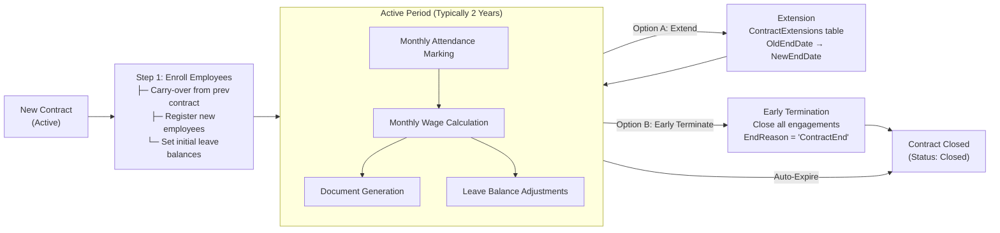

### 3.6 Attendance Management Module

#### 3.6.1 Description

The **core module** of the system. It provides a monthly grid-based interface for marking daily attendance of contract employees. The system uses 0-indexed months internally (0=January, 11=December).

#### 3.6.2 Functional Requirements

| ID | Requirement | Priority |
|----|-------------|----------|
| REQ-ATT-01 | The system SHALL display a monthly grid showing all eligible employees with each calendar day as a cell. Each cell can be toggled between Present (1), Absent (0), Half-Day (0.5), or left empty. | High |
| REQ-ATT-02 | **Status values:** 0 = Absent, 1 = Present, 0.5 = Half-Day. NULL = not yet filled. | High |
| REQ-ATT-03 | **Leave types:** When absent, admin MUST specify a leave type: `Paid`, `Unpaid`. When half-day is taken, the 1st half-day is marked as `Carried` with StatusValue=1, the 2nd half-day prompts for Paid or Unpaid — if Paid, StatusValue=1 and LeaveType=`Paired Paid`; if Unpaid, StatusValue=0 and LeaveType=`Paired Unpaid`. | High |
| REQ-ATT-04 | **Saturday rule:** If an employee is absent on ANY day Monday–Friday of a week, the following Saturday is automatically marked Absent (StatusValue=0, AutoSat=1). If the employee is present ALL 5 days (Mon–Fri), Saturday is automatically marked Present (StatusValue=1). If an employee takes a half-day during the week, the Saturday is NOT marked absent (the half-day counts as attendance). | High |
| REQ-ATT-05 | **Admin Saturday override:** Admin can manually override the automatic Saturday marking via right-click edit. When overridden, a remark is recorded. Admin can also mark an employee Present on a holiday and record a remark for that day — this can be used as a compensatory leave other day. | High |
| REQ-ATT-06 | **Non-admin restrictions:** Regular Users (POCs) can only mark attendance for the **current day**. They cannot modify any previous dates. They CANNOT override Saturday attendance — only admin can do this. | High |
| REQ-ATT-07 | **Admin modification:** Admin can change attendance data for **any date** without restriction. | High |
| REQ-ATT-08 | **Holiday marking:** Admin can mark specific dates as holidays in the attendance grid. Holidays count as Present for wage calculation purposes. Admin can also add remarks for holidays. | High |
| REQ-ATT-09 | **Global Adjustment:** There is a "GLOBAL" adjustment option in the attendance page. If total working days do not reach 26 days (or for any other reason), admin can set a global adjustment value that adds to all employees' present days for that month. Category-specific global adjustments (GLOBAL_Skilled, GLOBAL_Semi-Skilled, GLOBAL_Unskilled) are also supported. | High |
| REQ-ATT-10 | **Saturday auto-recalculation:** When attendance data is saved, the system automatically recalculates the first-Saturday attendance of the next month based on the last 5 working days of the current month. | High |
| REQ-ATT-11 | The system SHALL validate leave balances before saving. If an employee's leave balance would go negative, the save is rejected with an error message. | High |
| REQ-ATT-12 | The system SHALL maintain a unique constraint on `(EmpID, Year, Month, Day)` — one record per employee per day. | High |
| REQ-ATT-13 | The grid SHALL show employees filtered by: Category (Skilled/Semi-Skilled/Unskilled), Division, and text search. For non-admin users, only their assigned divisions' employees are shown. | High |

#### 3.6.3 Attendance Marking Logic

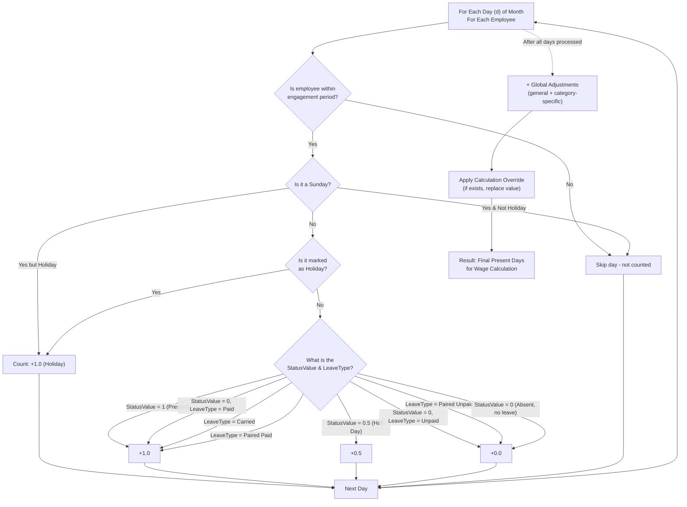

#### 3.6.4 Saturday Auto-Marking Rule

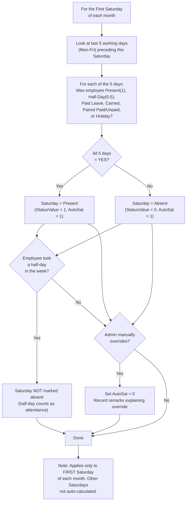

### 3.7 Calculation / Payroll Module

#### 3.7.1 Description

The Calculation module computes monthly wages for each employee based on attendance data, wage rates, and manual overrides. Wages are calculated as `WageRate × PresentDays = TotalWage`.

#### 3.7.2 Functional Requirements

| ID | Requirement | Priority |
|----|-------------|----------|
| REQ-CAL-01 | The system SHALL display a monthly calculation grid showing each employee's present days, wage rate, calculated amount, and final days. | High |
| REQ-CAL-02 | Admin SHALL be able to set **wage rates** per category per month (e.g., Skilled = ₹650/day, Semi-Skilled = ₹500/day, Unskilled = ₹350/day). Rates are stored in `CalculationWages` table. | High |
| REQ-CAL-03 | Admin SHALL be able to **override** the present days for an individual employee (increase or decrease). The override is recorded in `CalculationOverrides` table with a remarks field. | High |
| REQ-CAL-04 | Admin SHALL be able to **remove overrides** (revert to auto-calculated present days). | Medium |
| REQ-CAL-05 | The calculation SHALL filter by year, month, category, division, and optionally contract period. | High |
| REQ-CAL-06 | Admin SHALL be able to **change present days** for employees — for example: if an employee was marked Present in a previous month but was actually absent, admin can deduct days here. Conversely, if an employee was mistakenly marked Absent, days can be added here. | High |
| REQ-CAL-07 | Wages SHALL be calculated as: `FinalDays × WageRate = TotalWage`. The FinalDays is either the auto-calculated present days or the manual override value. | High |
| REQ-CAL-08 | Global adjustments (both general and category-specific) SHALL be applied before overrides. | High |

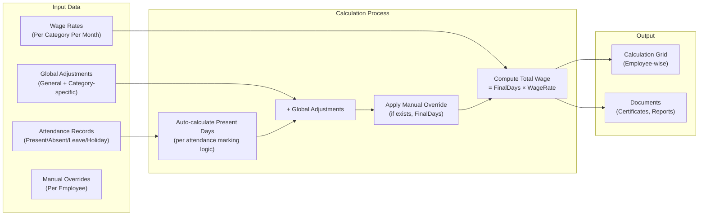

### 3.8 Ledger Module

#### 3.8.1 Description

The Ledger provides a comprehensive monthly view of each employee's attendance summary, leave balance tracking, and all associated remarks.

#### 3.8.2 Functional Requirements

| ID | Requirement | Priority |
|----|-------------|----------|
| REQ-LED-01 | The system SHALL display for each employee per month: Opening Balance, Paid Leave count, Half-Day count, Unpaid Leave count, Saturday Cuts count, Closing Balance, Present Days, Final Days, and all Remarks. | High |
| REQ-LED-02 | **Opening Balance** = Initial Leave Balance - (Historical Paid Leaves + 0.5 × Historical Half-Days). | High |
| REQ-LED-03 | **Closing Balance** = Opening Balance - Current Month Paid Leaves - (0.5 × Legacy Half-Days). | High |
| REQ-LED-04 | **Paired half-days** — the first half-day is `Carried` (counted as present, StatusValue=1), the second half-day creates a pair where the user picks `Paired Paid` (StatusValue=1) or `Paired Unpaid` (StatusValue=0). The ledger shows paired remarks like "2 half days: 01-Jun & 15-Jun". | High |
| REQ-LED-05 | The ledger SHALL display **Saturday edits** with remarks (e.g., "Saturday edited: 2026-06-06 (Reason: Overtime)"). | High |
| REQ-LED-06 | The ledger SHALL display **holiday details** for the selected month. | Medium |
| REQ-LED-07 | The ledger SHALL display the **global adjustment value** applied. | Medium |
| REQ-LED-08 | The ledger SHALL support filtering by year, month, category, contract period, and text search. | High |
| REQ-LED-09 | **Non-admin users** SHALL only see employees from their assigned divisions in the ledger. | High |
| REQ-LED-10 | The ledger SHALL show **join/resign remarks** if the employee joined or resigned during the selected month (e.g., "Joined on 15-Jun-2026" or "Resigned on 20-Jun-2026"). | Medium |

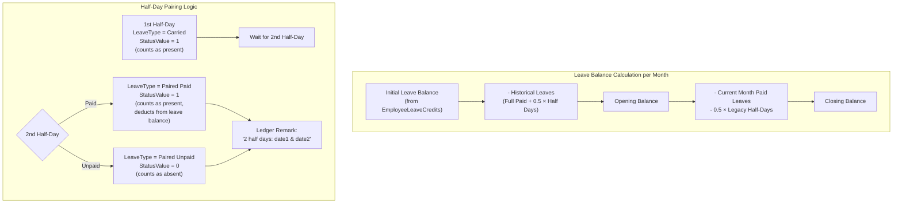

### 3.9 Document Generation Module

#### 3.9.1 Description

Generates official documents including Attendance Certificates, Satisfactory Certificates, Covering Letters, and Wage Calculation reports. **Invoice.aspx is not used** — all document generation is handled through **Documents.aspx**.

#### 3.9.2 Functional Requirements

| ID | Requirement | Priority |
|----|-------------|----------|
| REQ-DOC-01 | The system SHALL generate **Attendance Certificates** listing employees with their present days, paid/unpaid leaves, Saturday cuts, and final days. | High |
| REQ-DOC-02 | The system SHALL generate **Satisfactory Certificates** for vendors confirming satisfactory service of contract employees. | High |
| REQ-DOC-03 | The system SHALL generate **Covering Letters** addressed to the purchasing department (D-FMM/Purchase). | High |
| REQ-DOC-04 | The system SHALL generate **Wage Calculation reports** showing employee-wise wage computation. | High |
| REQ-DOC-05 | **Template customization:** All document templates are stored in `CertificateTemplates` table and can be customized in the **Settings page** (Template Settings). Templates use **placeholder presets** like `{VendorName}`, `{ContractNo}`, `{StartDate}`, `{EndDate}`, `{Category}`, `{EmpCount}`, etc. | High |
| REQ-DOC-06 | **Signing authority:** In Satisfactory Certificates and Covering Letters, the signing authority name is fetched using the PCNO of the authorized signatory. | High |
| REQ-DOC-07 | The system SHALL support configurable font size, section spacing, and signature spacing for generated documents. | Medium |
| REQ-DOC-08 | The system SHALL generate documents based on selected year, month, category, and contract period. | High |
| REQ-DOC-09 | Documents can be generated in HTML format for printing. The system also supports export to DOC/DOCX and XLSX formats. | Medium |

### 3.10 Notices Module

#### 3.10.1 Description

Admin can upload, manage, and publish official notices and documents visible to all authenticated users.

#### 3.10.2 Functional Requirements

| ID | Requirement | Priority |
|----|-------------|----------|
| REQ-NOT-01 | Admin SHALL be able to upload notices/files with a name and file path. | Medium |
| REQ-NOT-02 | Admin SHALL be able to hide/unhide notices. | Low |
| REQ-NOT-03 | All authenticated users SHALL be able to view visible notices. | Medium |

### 3.11 Remarks / Correction Request Module

#### 3.11.1 Description

Regular Users (POCs) can submit attendance correction requests to the admin when they notice discrepancies.

#### 3.11.2 Functional Requirements

| ID | Requirement | Priority |
|----|-------------|----------|
| REQ-RMK-01 | Regular Users SHALL be able to submit a remark regarding an employee's attendance, specifying the employee, the date in question, and the message. | High |
| REQ-RMK-02 | Admin SHALL receive a notification (badge on the bell icon in the navigation bar) showing the count of unread remarks. | High |
| REQ-RMK-03 | Admin SHALL be able to view all remarks, mark them as read, or delete them. | High |
| REQ-RMK-04 | Regular Users SHALL be able to view their own sent remarks history. | Medium |
| REQ-RMK-05 | Remarks SHALL store: SubmittedBy (PCNO), SenderName, EmpID (MasterId), RemarkDate, Message, IsRead flag, and CreatedAt timestamp. | High |

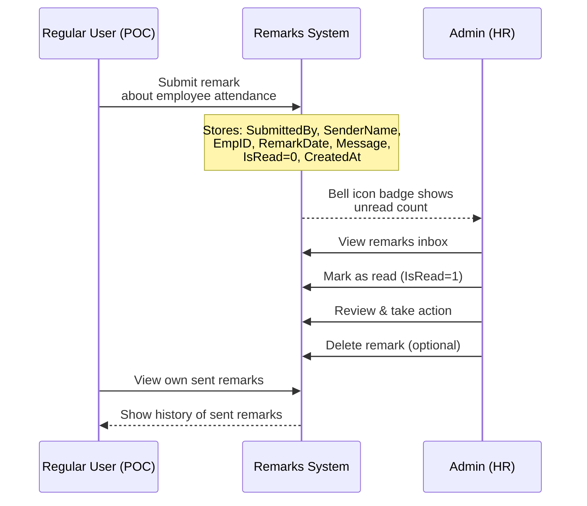

### 3.12 Admin / User Management Module

#### 3.12.1 Description

Manages system user accounts. Admin users have full access, while Regular Users are restricted to specific divisions.

#### 3.12.2 Functional Requirements

| ID | Requirement | Priority |
|----|-------------|----------|
| REQ-ADM-01 | Admin SHALL be able to create, edit, and delete Admin users. | High |
| REQ-ADM-02 | Admin SHALL be able to create, edit, and delete Regular Users and assign division-level permissions. | High |
| REQ-ADM-03 | Admin SHALL be able to revoke access for any user (sets Role to 2 or 3). | High |
| REQ-ADM-04 | Admin SHALL be able to restore access for revoked users (sets Role back to 1 or 0). | High |
| REQ-ADM-05 | Users are identified by their **PCNO** (same as AD username). | High |

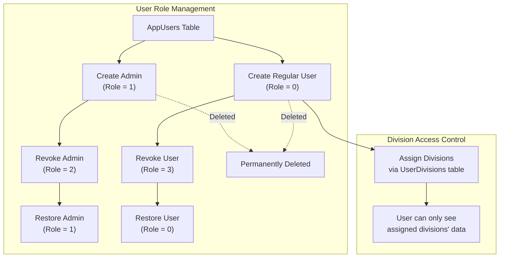

### 3.13 Settings Module

#### 3.13.1 Description

System settings and configuration management.

#### 3.13.2 Functional Requirements

| ID | Requirement | Priority |
|----|-------------|----------|
| REQ-SET-01 | **Division Management:** Admin SHALL be able to add, edit, and delete divisions. Editing a division name cascades to all employee records. Deleting is blocked if employees are assigned to the division. | High |
| REQ-SET-02 | **Category Management:** Admin SHALL be able to add, edit, and delete categories. Editing cascades to Employees, CalculationWages, and CalculationOverrides tables. Deleting is blocked if employees or wage records exist. | High |
| REQ-SET-03 | **Undo Manager:** Admin SHALL be able to undo the last N actions (employee adds, edits, upgrades, downgrades, transfers). The system supports sequential rollback of linked changes. Bulk leave adjustments cannot be undone. If attendance records exist for the employee, add/delete actions cannot be undone. The undo restores the `PreState` JSON snapshot from `EmployeeActionLogs`. | High |
| REQ-SET-04 | **Database Backup:** Admin SHALL be able to export all application tables as a JSON file for backup. | High |
| REQ-SET-05 | **Database Restore:** Admin SHALL be able to restore the database from a previously exported JSON backup file. The restore process deletes existing data, reinserts from the backup, and resets sequences. | High |
| REQ-SET-06 | **Template Settings:** Admin SHALL be able to customize document templates (Certificate descriptions, Satisfactory Certificate content, Covering Letter content, Wage Calculation headers). Placeholder presets like `{VendorName}`, `{ContractNo}`, `{Category}`, `{StartDate}`, `{EndDate}`, `{Year}` are used to represent specific data. | High |
| REQ-SET-07 | Admin SHALL also be able to customize **Attendance Report Templates** with configurable headings. | Medium |

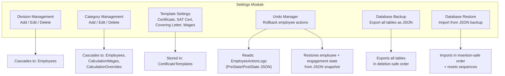

---

## 4. External Interface Requirements

### 4.1 User Interfaces

The system uses a modern, Bootstrap 4-based responsive UI with the SB Admin 2 template. Key UI characteristics:

- **Layout:** Fixed-top navigation bar with sidebar menu. Admin sees all menu items; Regular Users see a restricted subset.
- **Theme:** Dark gradient backgrounds (dark blue/navy shades), glass-morphism card designs, gradient buttons.
- **Attendance Grid:** Interactive month-grid with cells for each employee/day combination. Color-coded: Green = Present, Red = Absent, Yellow = Half-Day, Purple = Holiday.
- **Modals:** Used extensively for forms (add/edit employee, vendor, contract, etc.).
- **Toast notifications:** For success/error messages.
- **JavaScript libraries:** AngularJS (for data binding), Bootstrap 4.x, FontAwesome icons, SB Admin 2 template.

### 4.2 Hardware Interfaces

No direct hardware interfaces. Printing is handled via browser print functionality.

### 4.3 Software Interfaces

| Interface | Technology | Purpose |
|-----------|------------|---------|
| **Database** | Oracle.ManagedDataAccess.Client (.NET Data Provider) | All CRUD operations on Oracle 11g |
| **Active Directory** | System.DirectoryServices (LDAP) | User authentication |
| **File System** | System.IO | CSV file import, notice file management |

### 4.4 Communications Interfaces

- **HTTP/HTTPS:** The application runs on IIS and communicates with clients via standard HTTP.
- **LDAP:** The application communicates with Active Directory via LDAP protocol.
- **Oracle Net Services:** The application communicates with the Oracle database via Oracle Net (port 1521 by default).

---

## 5. Non-Functional Requirements

### 5.1 Performance Requirements

| ID | Requirement | Priority |
|----|-------------|----------|
| REQ-PERF-01 | The attendance grid for a month should load within 5 seconds for up to 200 employees. | Medium |
| REQ-PERF-02 | The calculation page should process data for up to 200 employees within 10 seconds. | Medium |
| REQ-PERF-03 | Database queries should complete within 3 seconds under normal load. | Medium |
| REQ-PERF-04 | The system should support concurrent access by at least 10 users simultaneously. | Medium |

### 5.2 Security Requirements

| ID | Requirement | Priority |
|----|-------------|----------|
| REQ-SEC-01 | All users MUST authenticate via Active Directory before accessing the system. | High |
| REQ-SEC-02 | Users who cannot be found in `AppUsers` after AD authentication MUST be denied access. | High |
| REQ-SEC-03 | Revoked users (Role 2 or 3) MUST be denied access with a clear message. | High |
| REQ-SEC-04 | Regular Users MUST only see data from their assigned divisions. | High |
| REQ-SEC-05 | Regular Users MUST NOT be able to override Saturday attendance. | High |
| REQ-SEC-06 | Regular Users MUST NOT be able to modify attendance for past dates. | High |
| REQ-SEC-07 | Page-level access control MUST be enforced in the code-behind of each page. | High |
| REQ-SEC-08 | Database connection strings and LDAP paths are stored in `Web.config` and should be encrypted in production. | High |

### 5.3 Software Quality Attributes

| Attribute | Requirement |
|-----------|-------------|
| **Reliability** | The system should maintain data integrity during concurrent access. The `AutoCloseExpiredContracts` feature uses thread-safe locking to prevent race conditions. |
| **Maintainability** | Code is organized in a standard ASP.NET Web Forms project structure with utility classes (`DBHelper.cs`, `ADHelper.cs`, `ActionLogger.cs`). |
| **Data Integrity** | Foreign key constraints are enforced at the database level. Attendance records have a unique constraint on `(EmpID, Year, Month, Day)`. |
| **Availability** | The system should be available during working hours (9 AM - 6 PM) with minimal downtime. |
| **Recoverability** | Full database backup/restore functionality via JSON export/import. Action logs with JSON state snapshots support undo operations. |

---

## 6. Database Architecture and Design

### 6.1 Schema Overview

The system uses **two Oracle database schemas**:

| Schema | Purpose | Tables |
|--------|---------|--------|
| **HRDATA** | Company's existing HR database (read-only for the app) | `empdetails` |
| **SYSTEM** (App Schema) | Application's own data tables | 20+ tables for attendance, employees, contracts, vendors, etc. |

### 6.2 Entity-Relationship Diagram

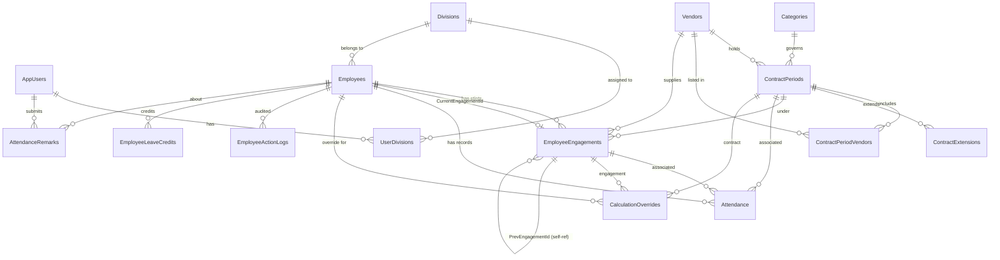

### 6.3 Table Descriptions and Relationships

#### 6.3.1 `hrdata.empdetails` (HRDATA Schema)

External company HR table — read by login to fetch employee name, designation, and division.

| Column | Type | Description |
|--------|------|-------------|
| `PCNO` | VARCHAR2(50) PK | Personnel/Company Number |
| `NAME` | VARCHAR2(200) | Employee display name |
| `DESIGNATION` | VARCHAR2(100) | Job title |
| `DIVNAME` | VARCHAR2(100) | Division/department |

#### 6.3.2 `AppUsers`

Application user registry — stores PCNO, name, and role.

| Column | Type | Description |
|--------|------|-------------|
| `PCNO` | VARCHAR2(50) PK | Personnel Number (matches AD EmployeeID) |
| `Name` | VARCHAR2(200) | Display name |
| `Role` | NUMBER(1) | 1=Admin, 0=Regular User, 2=Revoked Admin, 3=Revoked User |

**Relationships:** `PCNO` → `UserDivisions.PCNO`, `AttendanceRemarks.SubmittedBy`

#### 6.3.3 `Divisions`

Organizational divisions/departments.

| Column | Type | Description |
|--------|------|-------------|
| `Id` | NUMBER PK | Auto-incremented via SEQ_Divisions |
| `Name` | VARCHAR2(100) UNIQUE | Division name |

**Relationships:** `Name` → `Employees.Department`, `UserDivisions.DivisionName`

#### 6.3.4 `Categories`

Employee skill categories.

| Column | Type | Description |
|--------|------|-------------|
| `Id` | NUMBER PK | Auto-incremented via SEQ_Categories |
| `Name` | VARCHAR2(100) UNIQUE | Category name (Skilled, Semi-Skilled, Unskilled) |

**Relationships:** `Name` → `ContractPeriods.Category`, `EmployeeEngagements.Category`, `CalculationWages.Category`, `CalculationOverrides.Category`

#### 6.3.5 `UserDivisions`

Maps regular users to divisions they can manage.

| Column | Type | Description |
|--------|------|-------------|
| `PCNO` | VARCHAR2(50) PK, FK→AppUsers | User PCNO |
| `DivisionName` | VARCHAR2(100) PK, FK→Divisions | Assigned division |

#### 6.3.6 `Vendors`

Manpower agencies/contractors.

| Column | Type | Description |
|--------|------|-------------|
| `Id` | NUMBER PK | Auto-incremented |
| `MasterId` | VARCHAR2(50) UNIQUE | Vendor code (e.g., VND001) |
| `Name` | VARCHAR2(150) UNIQUE | Vendor company name |
| `GemId` | VARCHAR2(100) | Government e-Marketplace ID |
| `ContactName` | VARCHAR2(100) | Contact person |
| `ContactPhone` | VARCHAR2(20) | Phone number |
| `Address` | VARCHAR2(4000) | Postal address |
| `IsActive` | NUMBER(1) | 1=Active, 0=Inactive |

**Relationships:** `Id` → `ContractPeriods.VendorId`, `ContractPeriodVendors.VendorId`, `EmployeeEngagements.VendorId`

#### 6.3.7 `ContractPeriods`

Contract periods linking vendors to categories.

| Column | Type | Description |
|--------|------|-------------|
| `Id` | NUMBER PK | Auto-incremented |
| `Category` | VARCHAR2(100) FK→Categories | Skill category |
| `VendorId` | NUMBER FK→Vendors | Primary vendor |
| `GemId` | VARCHAR2(100) | GeM contract ID |
| `StartDate` | DATE | Contract start |
| `EndDate` | DATE | Contract end (NULL=ongoing) |
| `DatedOn` | DATE | Contract signing date |
| `Status` | VARCHAR2(20) | Active / Closed |
| `Notes` | VARCHAR2(4000) | Free-text notes |

**Unique Constraint:** `(Category, StartDate)`  
**Relationships:** `Id` → `EmployeeEngagements.ContractPeriodId`, `Attendance.ContractPeriodId`, `CalculationOverrides.ContractPeriodId`, `ContractExtensions.ContractPeriodId`, `ContractPeriodVendors.ContractPeriodId`

#### 6.3.8 `ContractPeriodVendors`

Junction table — all vendors participating in a contract period.

| Column | Type | Description |
|--------|------|-------------|
| `Id` | NUMBER PK | Auto-incremented |
| `ContractPeriodId` | NUMBER FK | Contract period |
| `VendorId` | NUMBER FK | Vendor |
| `Category` | VARCHAR2(100) | Worker category |
| `IsActive` | NUMBER(1) | Active status |

#### 6.3.9 `ContractExtensions`

Tracks extensions to contract periods.

| Column | Type | Description |
|--------|------|-------------|
| `Id` | NUMBER PK | Auto-incremented |
| `ContractPeriodId` | NUMBER FK | Extended contract |
| `OldEndDate` | DATE | Previous end date |
| `NewEndDate` | DATE | New end date |
| `ExtensionDate` | TIMESTAMP | When extended |

#### 6.3.10 `Employees`

Master employee registry.

| Column | Type | Description |
|--------|------|-------------|
| `MasterId` | VARCHAR2(50) PK | Permanent unique ID |
| `ID` | VARCHAR2(50) | Display ID |
| `Name` | VARCHAR2(200) | Full name |
| `Department` | VARCHAR2(100) FK→Divisions | Current division |
| `Category` | VARCHAR2(50) | Current category |
| `OriginalJoinDate` | DATE | First-ever join date |
| `JoinDate` | DATE | Current engagement start |
| `LeaveBalance` | NUMBER | Current paid leave balance |
| `PrevLeaveBalance` | NUMBER | Previous contract leave balance |
| `Status` | VARCHAR2(20) | Active/Resigned/ContractEnded/Upgraded/Downgraded/Transferred |
| `ResignDate` | DATE | Resignation date |
| `ContractEndDate` | DATE | Contract end date |
| `CurrentEngagementId` | NUMBER FK→EmployeeEngagements | Active engagement pointer |
| `Phone` | VARCHAR2(50) | Phone number |
| `Email` | VARCHAR2(100) | Email |
| `Aadhar` | VARCHAR2(50) | Aadhar number |
| `Address` | VARCHAR2(4000) | Address |
| `Qualification` | VARCHAR2(200) | Educational qualification |
| `Experience` | NUMBER | Years of experience |
| `ExperienceIn` | VARCHAR2(200) | Experience domain(s) |

**Relationships:** `MasterId` → `EmployeeEngagements.EmpID`, `Attendance.EmpID`, `CalculationOverrides.EmpID`, `EmployeeActionLogs.EmpMasterId`, `AttendanceRemarks.EmpID`, `EmployeeLeaveCredits.EmpID`

#### 6.3.11 `EmployeeEngagements`

Employment stints — one employee can have multiple engagements over time.

| Column | Type | Description |
|--------|------|-------------|
| `Id` | NUMBER PK | Auto-incremented |
| `EmpID` | VARCHAR2(50) FK→Employees | Employee MasterId |
| `ContractPeriodId` | NUMBER FK→ContractPeriods | Contract context |
| `Category` | VARCHAR2(100) | Category for this stint |
| `VendorId` | NUMBER FK→Vendors | Supplying vendor |
| `Department` | VARCHAR2(100) | Division for this stint |
| `StartDate` | DATE | Engagement start |
| `EndDate` | DATE | Engagement end |
| `EndReason` | VARCHAR2(50) | Resigned/ContractEnded/Upgraded/Downgraded/CarriedOver |
| `IsCarriedOver` | NUMBER(1) | 1=carried from prev contract |
| `PrevEngagementId` | NUMBER FK (self-ref) | Previous engagement in chain |
| `EmployeeId` | VARCHAR2(50) | Official ID in this engagement |

**Relationships:** `Id` → `Employees.CurrentEngagementId`, `Attendance.EngagementId`, `CalculationOverrides.EngagementId`. `PrevEngagementId` → self-reference for engagement chaining.

#### 6.3.12 `EmployeeLeaveCredits`

Date-specific leave credits/bulk additions.

| Column | Type | Description |
|--------|------|-------------|
| `Id` | NUMBER PK | Auto-incremented |
| `EmpID` | VARCHAR2(50) FK→Employees | Employee |
| `ContractPeriodId` | NUMBER FK→ContractPeriods | Contract context |
| `Amount` | NUMBER | Leave days added |
| `EffectiveDate` | DATE | When the credit applies |
| `Remarks` | VARCHAR2(200) | Reason/note |

#### 6.3.13 `Attendance`

Core attendance table — one row per employee per day.

| Column | Type | Description |
|--------|------|-------------|
| `Id` | NUMBER PK | Auto-incremented |
| `EmpID` | VARCHAR2(50) FK→Employees | Employee |
| `EngagementId` | NUMBER FK→EmployeeEngagements | Active engagement |
| `ContractPeriodId` | NUMBER FK→ContractPeriods | Contract context |
| `Year` | NUMBER(4) | Calendar year |
| `Month` | NUMBER(2) | Month (0-indexed: 0=Jan) |
| `Day` | NUMBER(2) | Day of month |
| `StatusValue` | NUMBER(1) | 0=Absent, 1=Present, 0.5=Half-Day, NULL=unfilled |
| `LeaveType` | VARCHAR2(50) | Paid/Unpaid/Carried/Paired Paid/Paired Unpaid |
| `IsHoliday` | NUMBER(1) | 1=Holiday |
| `AutoSat` | NUMBER(1) | 1=Auto-calculated Saturday |
| `Remarks` | VARCHAR2(500) | Free-text remarks |

**Unique Constraint:** `(EmpID, Year, Month, Day)`

#### 6.3.14 `CalculationWages`

Monthly wage rates per category.

| Column | Type | Description |
|--------|------|-------------|
| `Year` | NUMBER(4) PK | Year |
| `Month` | NUMBER(2) PK | Month (0-indexed) |
| `Category` | VARCHAR2(50) PK | Category name |
| `WageRate` | NUMBER(10,2) | Daily wage rate |

#### 6.3.15 `CalculationOverrides`

Manual overrides of present days for wage calculation.

| Column | Type | Description |
|--------|------|-------------|
| `Year` | NUMBER(4) PK | Year |
| `Month` | NUMBER(2) PK | Month |
| `Category` | VARCHAR2(50) PK | Category |
| `EmpID` | VARCHAR2(50) PK, FK→Employees | Employee |
| `EngagementId` | NUMBER FK | Engagement context |
| `ContractPeriodId` | NUMBER FK | Contract context |
| `FinalDays` | NUMBER(5,2) | Overridden days |
| `Remarks` | VARCHAR2(500) | Reason for override |

#### 6.3.16 `EmployeeActionLogs`

Audit trail with snapshots for undo support.

| Column | Type | Description |
|--------|------|-------------|
| `Id` | NUMBER PK | Auto-incremented |
| `ActionTime` | TIMESTAMP | When action occurred |
| `ActionType` | VARCHAR2(50) | ADD/EDIT/RESIGN/UPGRADE/DOWNGRADE/UNDO etc. |
| `EmpMasterId` | VARCHAR2(50) | Affected employee |
| `Description` | VARCHAR2(500) | Human-readable summary |
| `PreState` | CLOB | JSON before state |
| `PostState` | CLOB | JSON after state |
| `IsUndone` | NUMBER(1) | 1=undo performed |

#### 6.3.17 `AttendanceRemarks`

Correction requests sent by POCs to admin.

| Column | Type | Description |
|--------|------|-------------|
| `Id` | NUMBER PK | Auto-incremented |
| `SubmittedBy` | VARCHAR2(100) | PCNO of submitter |
| `SenderName` | VARCHAR2(200) | Display name |
| `EmpID` | VARCHAR2(50) | Employee being remarked about |
| `RemarkDate` | DATE | Attendance date referred to |
| `Message` | VARCHAR2(1000) | Remark text |
| `IsRead` | NUMBER(1) | 0=Unread, 1=Read |
| `CreatedAt` | TIMESTAMP | Submission timestamp |

#### 6.3.18 `Notices`

Official notices and uploaded documents.

| Column | Type | Description |
|--------|------|-------------|
| `Id` | NUMBER PK | Auto-incremented |
| `Name` | VARCHAR2(255) | Notice name |
| `FilePath` | VARCHAR2(500) | File path |
| `IsHidden` | NUMBER(1) | Visibility flag |
| `UploadDate` | TIMESTAMP | Upload timestamp |

#### 6.3.19 `CertificateTemplates`

Customizable templates for document generation.

| Column | Type | Description |
|--------|------|-------------|
| `TemplateKey` | VARCHAR2(50) PK | Template identifier (e.g., AttDesc1, SatSignatory) |
| `TemplateValue` | VARCHAR2(1000) | Template text with placeholders like `{VendorName}` |

#### 6.3.20 `ActionLog`, `AdminActionLog`, `Attendance_Audit_Log`

These tables exist in the schema but are **not actively used** by the application in the current version. They were created for future implementation. They will be removed once the project is finalized.

### 6.4 Key Business Logic in Database

#### Auto-Increment Strategy

All tables with numeric `Id` primary keys use Oracle 11g-compatible sequences with BEFORE INSERT triggers:

```sql
CREATE SEQUENCE SEQ_TableName START WITH 1 INCREMENT BY 1 NOCACHE NOCYCLE;

CREATE OR REPLACE TRIGGER TRG_TableName
BEFORE INSERT ON TableName
FOR EACH ROW
BEGIN
    IF :NEW.Id IS NULL THEN
        SELECT SEQ_TableName.NEXTVAL INTO :NEW.Id FROM DUAL;
    END IF;
END;
/
```

#### Key Foreign Key Relationships

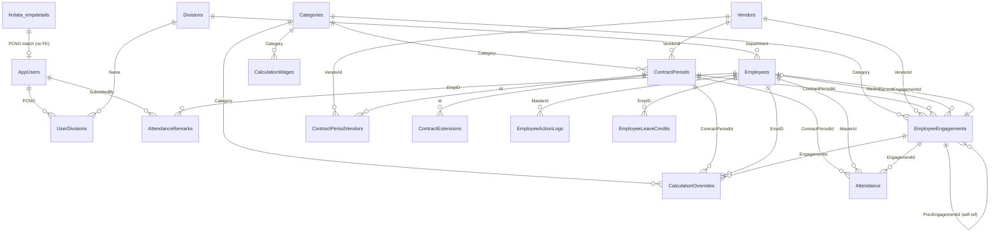

---

## 7. System Architecture

### 7.1 Architecture Overview

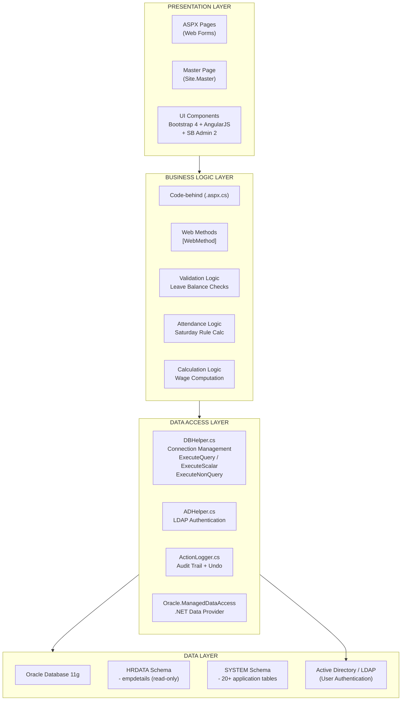

### 7.2 Technology Stack

| Layer | Technology | Version | Purpose |
|-------|-----------|---------|---------|
| **Frontend** | HTML5 / CSS3 | — | Page structure and styling |
| | Bootstrap | 4.x | Responsive UI framework |
| | SB Admin 2 | — | Admin dashboard template |
| | FontAwesome | — | Icon library |
| | AngularJS | 1.x | Client-side data binding |
| | XLSX (SheetJS) | — | Excel file generation |
| **Backend** | ASP.NET Web Forms | 4.5 | Server-side page framework |
| | C# | 6.0 | Code-behind logic |
| | System.Web.Services | — | AJAX WebMethods |
| | System.DirectoryServices | — | LDAP/AD authentication |
| **Data Access** | Oracle.ManagedDataAccess.Client | — | Oracle database connectivity |
| | JSON serialization | — | Data transfer via WebMethods |
| **Database** | Oracle Database | 11g | Primary data store |
| | Sequences + Triggers | — | Auto-increment (Oracle 11g compatible) |
| **Utilities** | DBHelper.cs | — | Database connection and query execution |
| | ADHelper.cs | — | Active Directory authentication |
| | ActionLogger.cs | — | Audit trail management |
| **Configuration** | Web.config | — | Connection strings, AD path, app settings |

### 7.3 Module Interaction Flow

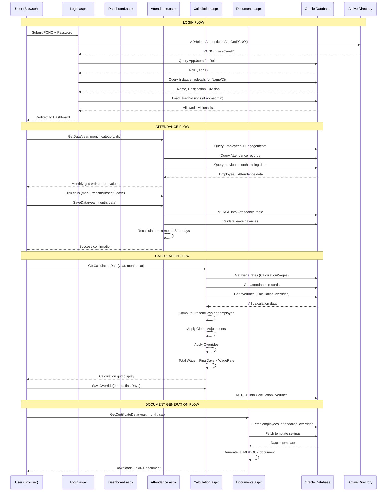

---

## 8. Glossary

| Term | Definition |
|------|------------|
| **Admin** | HR department user with full system access (Role=1). |
| **AD / LDAP** | Active Directory / Lightweight Directory Access Protocol — used for user authentication. |
| **AutoSat** | Automatic Saturday attendance marking based on weekday attendance pattern. |
| **Carried** | The first half-day in a pair — marked StatusValue=1 (counts as present). |
| **Contract Period** | A formal agreement between the organization and a vendor to supply workers of a specific category for a defined period (typically 2 years). |
| **Contract Extension** | Extending an active contract period's end date. |
| **Division / Department** | Organizational unit within the company (e.g., D-KRM, AD-Admin). |
| **Engagement** | An employment stint linking an employee to a specific contract period. |
| **GeM ID** | Government e-Marketplace portal ID for vendor contracts. |
| **Global Adjustment** | A system-wide modifier to present days applied to all employees in a month. |
| **Half-Day Pairing** | Two half-days paired together: 1st = Carried (StatusValue=1), 2nd = Paired Paid (StatusValue=1) or Paired Unpaid (StatusValue=0). |
| **MasterId** | Permanent unique identifier for employees (e.g., EMP-0001) and vendors (e.g., VND001). |
| **Oracle 11g** | Target database version. Uses sequences + triggers instead of identity columns. |
| **Paired Paid** | A second half-day that counts as paid leave (StatusValue=1). |
| **Paired Unpaid** | A second half-day that counts as unpaid leave (StatusValue=0). |
| **PCNO** | Personnel/Company Number — unique employee identifier used for login. |
| **POC / Regular User** | Point of Contact — a division-restricted user (Role=0) who marks attendance for contract employees. |
| **Re-joining** | When a resigned employee is rehired, their old MasterId and history are preserved. |
| **Satisfactory Certificate** | Document confirming vendor service quality. |
| **Wage Calculation** | Monthly computation of employee wages based on attendance. |

---

## 9. Appendices

### Appendix A: Placeholder Presets for Document Templates

The following placeholders can be used in `CertificateTemplates` values for dynamic document generation:

| Placeholder | Description |
|-------------|-------------|
| `{VendorName}` | Vendor company name |
| `{VendorAddress}` | Vendor postal address |
| `{ContractNo}` | GeM Contract ID |
| `{ContractDate}` | Contract signing date |
| `{DatedOn}` | Dated On date |
| `{Category}` | Employee skill category |
| `{CategoryDesc}` | Category description (e.g., "Data Entry Operators(Skilled)") |
| `{StartDate}` | Contract/period start date |
| `{EndDate}` | Contract/period end date |
| `{EmpCount}` | Number of employees |
| `{Year}` | Current year |
| `{Period}` | Contract period string |
| `{PaymentStart}` | Payment period start |
| `{PaymentEnd}` | Payment period end |
| `{WorkingDays}` | Number of working days |
| `{PeopleCount}` | People count for category |
| `{ExtraCode}` | Extra contract code |
| `{Services}` | Service description |
| `{Duration}` | Contract duration |
| `{WefDate}` | With effect from date |
| `{Division}` | Division name |

### Appendix B: File Structure

```mermaid
graph TD
    ATTENDANCE_APP["AttendanceApp/"] --> AGENTS[".agents/"]
    ATTENDANCE_APP --> VS[".vs/"]
    ATTENDANCE_APP --> PROPERTIES["Properties/"]
    ATTENDANCE_APP --> STATIC["Static/"]
    ATTENDANCE_APP --> UTILS["Utils/"]
    ATTENDANCE_APP --> BIN["bin/"]
    ATTENDANCE_APP --> EXAMPLE["example/"]
    ATTENDANCE_APP --> PACKAGES["packages/"]
    ATTENDANCE_APP --> ASPX_FILES["*.aspx (Web Forms)"]
    ATTENDANCE_APP --> CS_FILES["*.aspx.cs (Code-behind)"]
    ATTENDANCE_APP --> DESIGNER["*.aspx.designer.cs"]
    ATTENDANCE_APP --> MASTER["Site.Master"]
    ATTENDANCE_APP --> CONFIG["Web.config"]
    ATTENDANCE_APP --> PROJECT["AttendanceApp.csproj"]
    ATTENDANCE_APP --> DB_SETUP["oracle_setup.sql"]

    STATIC --> CSS["css/bootstrap.min.css"]
    STATIC --> JS["js/angular.min.js<br/>js/xlsx.full.min.js"]
    STATIC --> FONTAWESOME["fontawesome-free/"]

    UTILS --> AD_HELPER["ADHelper.cs<br/>(LDAP Auth)"]
    UTILS --> DB_HELPER["DBHelper.cs<br/>(DB Connection)"]
    UTILS --> ACTION_LOGGER["ActionLogger.cs<br/>(Audit/Undo)"]

    EXAMPLE --> DB_DOC["database_documentation.md"]
```

### Appendix C: Web Pages and Their Functions

| Page | Access | Function |
|------|--------|----------|
| `Login.aspx` | All | User authentication |
| `Dashboard.aspx` | All | Summary statistics |
| `Employee.aspx` | Admin only | Employee master management |
| `Attendance.aspx` | All (role-based) | Monthly attendance grid |
| `Calculation.aspx` | Admin only | Wage calculation |
| `Ledger.aspx` | All (role-based) | Monthly attendance ledger |
| `Documents.aspx` | Admin only | Document generation |
| `Invoice.aspx` | Not used | Legacy — all document generation in Documents.aspx |
| `Vendors.aspx` | Admin only | Vendor management |
| `Contracts.aspx` | Admin only | Contract lifecycle management |
| `AdminManagement.aspx` | Admin only | User account management |
| `Settings.aspx` | Admin only | System settings |
| `Remarks.aspx` | Admin only | Remark inbox |
| `UserRemarks.aspx` | Regular Users | Send/view remarks |
| `Notices.aspx` | All | View notices |
